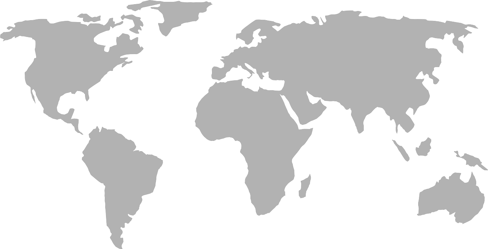

.. Geo-Python documentation master file, created by
   sphinx-quickstart on Thu Aug 23 14:00:02 2018.
   You can adapt this file completely to your liking, but it should at least
   contain the root `toctree` directive.

Willkommen zum Modul WebGIS 🗺🌐
===========================

Informationen zur `Weiterbildung Geodatenmanager/-in <https://wissenschaftliche-weiterbildung.info/Veranstaltung/cmx64c779c751049.html>`__ finden Sie `hier <https://wissenschaftliche-weiterbildung.info/Veranstaltung/cmx64c779c751049.html>`__  !

Das Modul behandelt die theoretischen Grundlagen zum Aufbau internetgestützter GIS-Plattformen. Dabei werden neben den grundlegenden Systemanforderungen an die Technik auch mögliche Umsetzungen mit 
Open Source- wie auch proprietären Softwarepakete vermittelt. Die Teilnehmenden erarbeiten sich in praktischen Übungen erste Kenntnisse zu Aufbau und Verwaltung eines Web-GIS unter Einbeziehung eigener und fremder Datensätzen.
Das Modul wird im Rahmen der berufsbegleitenden Weiterbildung Geodatenmanager/-in der Universität Tübingen genutzt & weiterentwickelt. 

Diese Übung behandelt die Erstellung interaktiven WebMaps mit OpenLayers & Leaflet.
Modul führt ein in Theorie, Anwendung und Praxis von Web-GIS. Theorie und Anwen-dungsbeispiele werden in den Präsentationsfolien erläutert.

Sie tasten sich Schritt für Schritt an die Erstellung von Karten im Internet heran, bis hin zu ei-nem vollständigen Web-GIS. Wir beginnen mit einem QGIS-Plugin, dass uns aus einem QGIS-Projekt eine einfache interaktive Webmap erstellt. Mit dieser einfachen interaktiven Webmap lernen wir die grundlegenden Technologien kennen, die fürs Internet gelten.
•	Kennenlernen Plugins
•	Anwenden HTML
•	Kennenlernen CSS, PHP, JavaScript-API

Der praktische Teil wird in diesem Modul mit Übungen zu QGIS-Server und Lizmap als Schwerpunkte vorgestellt. Das Desktop-GIS zur Vorbereitung von Web-GIS Projekten wird QGIS sein. 
Theoretisch kann mit anderen Desktop GIS auch gearbeitet werden.

Das Modul ist ausgerichtet auf die Entwicklung und Administration von Web-GIS Anwendun-gen, die Installation von Server und Client wird nicht behandelt. In den meisten Fällen in Bü¬ros oder Verwaltungen gibt es strenge IT-Regeln, für die eine Administrationsabteilung zu¬ständig ist. Ziel dieses Kurses ist es, spezielle Kenntnisse zu vermitteln, um mit diesen Abtei¬lungen erfolgreich zusammenarbeiten zu können.
Selbstverständlich können Web-GIS Systeme zum Testen und Üben auch lokal installiert werden. Entsprechende Anregungen werden am Rande gegeben und Unterlagen dazu wer-den bereitgestellt bzw. wird auf solche im Internet verwiesen.

Lernziele
---------

- Übersicht über verschiedene Web-GIS-Systeme.
- Kenntnisse der möglichen Einsatzbereiche und ihrer Grenzen.
- Kenntnisse spezifischer Systemanforderungen.
- Basiswissen zum Aufbau eines Web-GIS mit entsprechenden OGC (Open Geospatial Consortium) Standards.
- Implementierung eines Web-GIS mit Basisfunktionalität.
- Integration eigener Daten in ein Web-GIS.
- Einbindung von Hintergrundkarten in ein Web-GIS.
- Einführung in die Erstellung einer GDI.

Ablauf und Inhalte der Übungen
-----------------------------------------------------

Ablauf
~~~~~~

-  Die Übungen werden hier bereitgestellt.
-  Die Inhalte der Übungen sollt ihr euch großteils selbständig erarbeiten. In ILIAS findet ihr weitere Informationen, um die Übungsaufgaben zu meistern.
-  Die Vorlesungsfolien und alles weiteren Materialien werden euch über ILIAS bereitgestellt.
-  Bei Fragen wendet euch direkt an mich oder schreibt per Mail (siehe Folien).

Inhalte
~~~~~~~

Anhand der Übungen lernt ihr, **wie** ihr praktisch vorgeht, um ans Ziel zu kommen. Ihr versteht **warum** eure Lösungen funkionieren und erhaltet eine
Übersicht wie **WebMaps & WebGIS-Systeme** funktionieren. Die Übungen sind als praxisorientierte **Hands-On** Sessions gestaltet.

+-------+---------------------------+-----------------------------------------------------------------------------------------------------------------------------------------------------------------+
| Übung | Thema                     | Anwendungen, Tools u.ä.                                                                                                                                         |
+=======+===========================+=================================================================================================================================================================+
| 0     | WebGIS & Geoportale       | `Geoportal Hamburg <https://geoportal-hamburg.de/?lng=de>`__, `Geoportal Esslingen <https://stadtplan.esslingen.de/stadtplan/>`__                               |
+-------+---------------------------+-----------------------------------------------------------------------------------------------------------------------------------------------------------------+
| 1     | Erste interaktive Webmaps | `QGIS und qgis2web <https://plugins.qgis.org/plugins/qgis2web/>`__                                                                                              | 
+-------+---------------------------+-----------------------------------------------------------------------------------------------------------------------------------------------------------------+
| 2     | WebGIS mit Masterportal   | `VS Studio und Live Server <https://einfuhrung-gis-fur-geowissenschaften.readthedocs.io/de/latest/lessons/L2/exercise-2.html>`__                                |
+-------+---------------------------+-----------------------------------------------------------------------------------------------------------------------------------------------------------------+

--------------

.. admonition:: Hilfe

    Im Laude der Übungen werden euch typische Probleme von Geodaten und GIS-Software begegnen. Das Auftreten dieser Probleme ist i.d.R. beabsichtig. 
    Lösungen, Herangehensweisen zu diesen Problemen besprechen wir in der Vorlesung und während der gesamten Kurswoche.
    Online Hilfe findet ihr im `ILIAS <https://lms-ubinfo.uni-tuebingen.de/ilias3/ilias.php?baseClass=ilrepositorygui&cmd=render&ref_id=37481>`__ des Geographischen Instituts der Uni Heidelberg und ganz allgemein im Internet.

.. admonition:: Hilfe

    Starte mit dem Kurs indem du im Navigationsfesnter (links) die "Kursinhalte" & den Bereich "Wissenswertes" anschaust.

.. toctree::
    :maxdepth: 2
    :caption: Wissenswertes

    webgis-info/was-ist-webgIS
    webgis-info/hinweise

.. toctree::
    :maxdepth: 2
    :caption: Einen Überblick gewinnen

    lessons/L0/uebung-0

.. toctree::
    :maxdepth: 2
    :caption: Eine erste interaktive Webmap erstellen

    lessons/L1/overview
    lessons/L1/uebung-1
    lessons/L1/uebung-1_optional
    
.. toctree::
    :maxdepth: 2
    :caption: HTML, CSS & JavaScript

    lessons/L2/uebung-2

.. toctree::
    :maxdepth: 2
    :caption: Das Masterportal

    lessons/L3/exercise-3-ms_vorbereitung
    lessons/L3/exercise-3-ms_entwicklung
    lessons/L3/exercise-3-ms_layer
    lessons/L3/exercise-3-esri-eb

.. toctree::
    :maxdepth: 2
    :caption: OGC-Dienste erstellen

    lessons/L4/qgis-server_intro
    gis-data/ogc-standards
    lessons/L4/qgis-server
    lessons/L4/qgis-server_v2
    lessons/L4/qgis-server_v4

.. toctree::
    :maxdepth: 2
    :caption: Geonode

    lessons/L5/geonode_intro
    lessons/L5/daten_vorbereiten
    lessons/L5/daten_upload
    lessons/L5/karte_erstellen

.. toctree::
    :maxdepth: 2
    :caption: Metadatenstandards

    lessons/L6/metadaten
    lessons/L6/beispielnrw
    lessons/L6/catmdedit 
