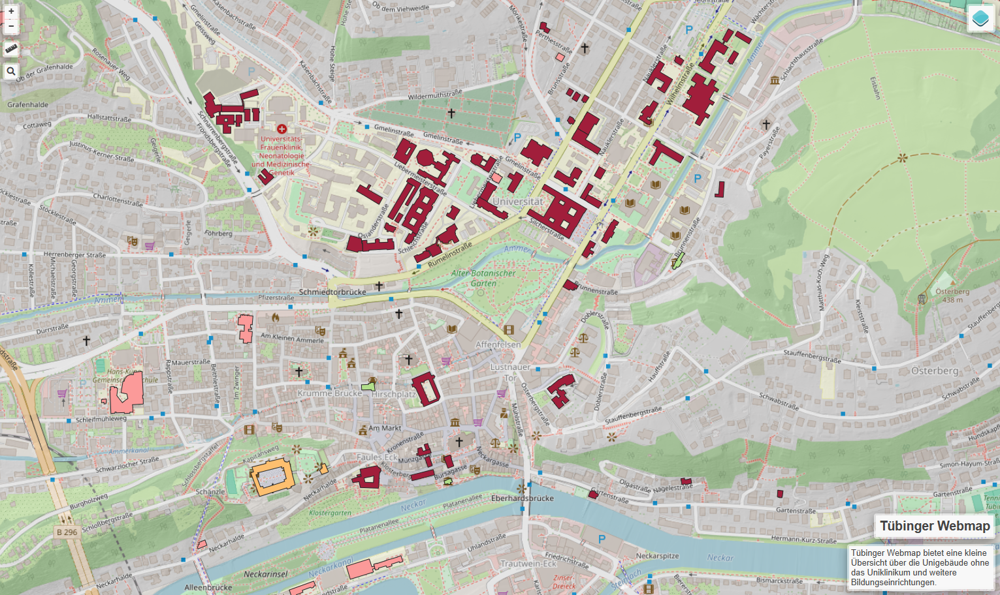
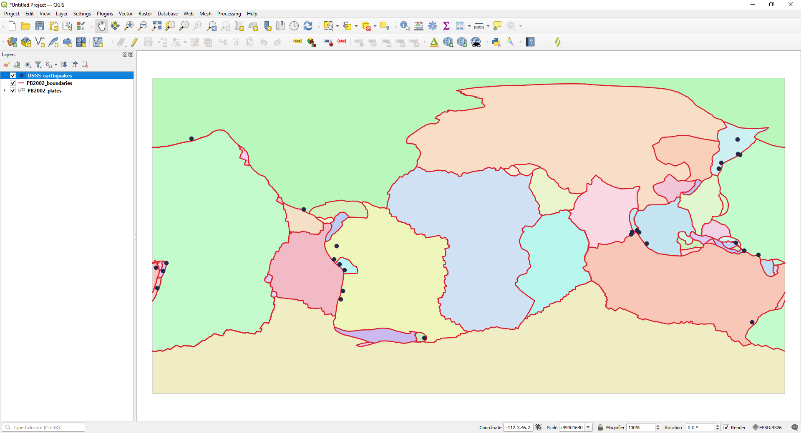

Übung 1
==========

.. hint::

   Ziel der Übung
      * Die ersten Schritte zum Webmapping
      * Die Benutzeroberfläche von qgis2web kennenlernen

.. important::

   Für Ihre Firma soll in die Internetpräsenz eine interaktive Karte eingebaut werden. Die von der Firma beauftragten Web-Entwickler/innen erwarten eine fertige Struktur, 
   die per Link aufgerufen werden kann. Die Lösung ist ein web-basierter Geoviewer der als Client-Lösung responsiv über einen Browser läuft. Hierfür gibt es mehrere Möglichkeiten.
   Wir werden uns in dieser und in den kommenden Aufgaben mit *OpenLayers*, *Leaflet* und dem *Masterportal* beschäftigen.

.. note::

   **Für diese Übung nutzen wir folgende Tools**
      *  `QGIS <https://qgis.org/>`__
      *  `Plugin *qgis2web* <https://plugins.qgis.org/plugins/qgis2web/>`__
      *  `QGIS Cloud <https://qgiscloud.com/de/pages/quickstart>`__

Aufgaben
--------

Mit dem Plugin *qgis2web* lassen sich schnell und einfach interaktive Webmaps erstellen. Dafür brauchen wir ein QGIS-Projekt mit einigen Layern:
-	Starte QGIS
-	Lade dir die Daten `„uebung_1_13.zip“ aus ILIAS <https://lms-ubinfo.uni-tuebingen.de/ilias3/ilias.php?baseClass=ilrepositorygui&ref_id=37653>`__ herunter
-	Öffne das QGIS-Projekt
      *	Füge mind. einen WMS oder WMTS-Layer hinzu
      *	OpenStreetMap 
      *	Digitales Orthophotos
      *	Installiere das Plugin *qgis2web* 

.. figure:: img/qgis2web.png
   :alt: QGIS-Plugin *qgis2web*
   :width: 800px

   QGIS-Plugin *qgis2web*

-	Öffne das Plugin *qgis2web*  

.. figure:: img/qgis2web_logo.png
   :alt: *qgis2web* Logo
   :width: 150px

   Logo *qgis2web*

- Passe zwei Popup Fields zu *inline Label - always visible* an

.. figure:: img/qgis2web_screenshot_ol_v2.PNG
   :alt: *qgis2web* Menü
   :width: 150px

   Menü *qgis2web*

-	Exportiere deine WebMap 

.. figure:: img/export.png
   :alt: *qgis2web* Export
   :width: 150px

   Export *qgis2web*

- Eine Browser-Tab sollte sich öffnen & die Karte anzeigen.

**So (oder ähnlich) kann deine erste Webmap aussehen**

   Webmap *qgis2web*

Gratulation! Deine erste Webmap ist fertig! 

Jetzt gehen wir an die Details
--------

1. Öffne QGIS und mach dich mit der Nutzeroberfläche vertraut.
2. Öffne die oben angegebenen Dateien in QGIS. Ladet dazu die Vektor-Layer in euer Programm.
3. Interagiere mit der Karte und erkunde die Datensätze. Verwende hierfür das Zoom-Werkzeug und verschiebe die Karte. Beachte dabei die
   Statusleiste am unteren Bildschirmrand und wie diese sich verändert. Wie lauten die ungefähren Koordinaten für das Erdbeben in Alaska?
4. Mache dich mit dem Layer-Fenster (*Layer List*) vertraut. Blende abwechselnd verschiedene Layer ein und aus und verschiebe die Layer
   in der Hierarchie. Benennt den PB2002_plates sinnvoll um. Beachte, dass letzteres keine Auswirkung auf die Datenquellen (Dateinamen, Speicherort) hat.
5. Schau dir die **Attributdaten der Layer** an. Schaue dir zu diesem Zweck die Attributtabelle an und mache dich mit der zugehörigen
   Nutzeroberfläche vertraut. a) Wie viele Features gibt es im PB2002_plates? b) Welche Magnitude hatte das Erdbeben vor der Küste Neuseelands?
6. Ändere die **Projektion in der Kartenansicht** zu WGS84 UTM32N (EPSG-Code: 32632). **Beachte, dass dies nichts an der Projektion
   (den Koordinaten) der Dateien ändert, sondern lediglich die Projektion der Kartenansicht beeinflusst.** Überprüfe dies in den Eigenschaften des Punkt-Layers. Welche Projektion ist dort angegeben?
7. Speichere nun den Plattengrenzen-Layer in der Projektion WGS84 UTM 32N. **Dies ändert die Projektion der Datei.** Überprüft dies in den Eigenschaften des neu erstellten Layers.
8. Speichere dein Projekt ab.

**So (oder ähnlich) sieht’s am Ende aus**

   Layer in QGIS zeigen Platten, Plattengrenzen & Erdbeben
