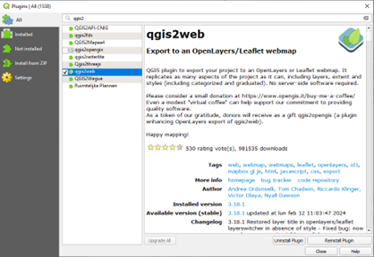
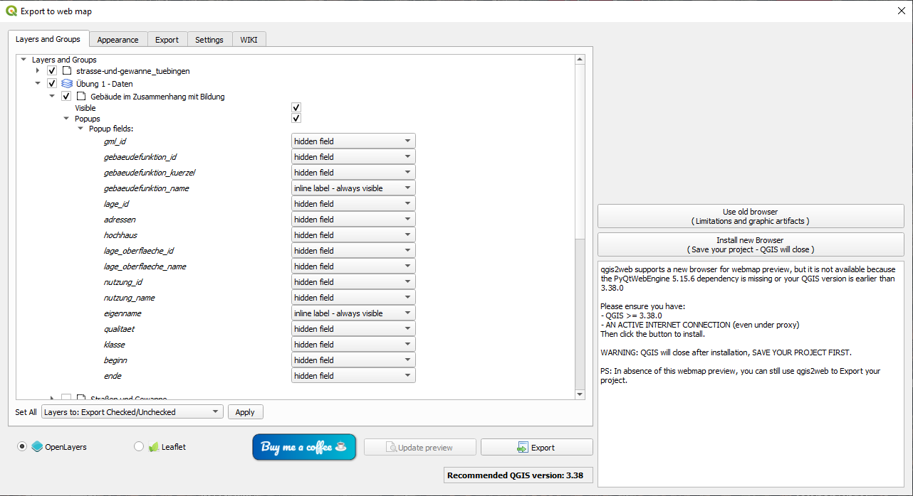
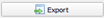
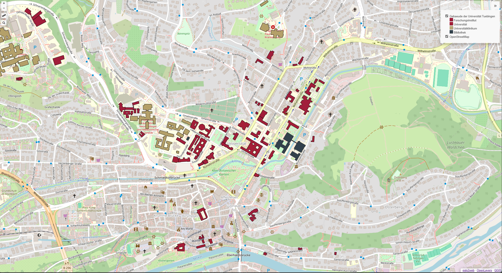
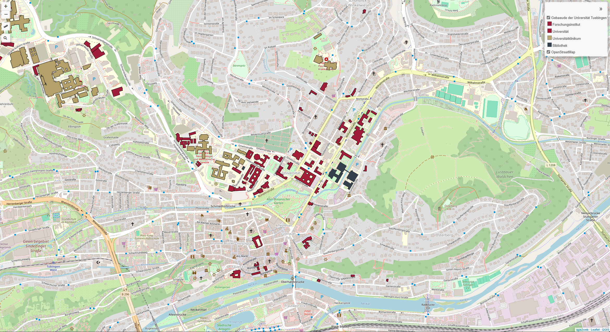

Übung 1
==========

.. hint::

   Ziel der Übung
      * Die ersten Schritte zum Webmapping
      * Die Benutzeroberfläche von qgis2web kennenlernen

.. important::

   Für Ihre Firma soll in die Internetpräsenz eine interaktive Karte eingebaut werden. Die von der Firma beauftragten Web-Entwickler/innen erwarten eine fertige Struktur, 
   die per Link aufgerufen werden kann. Die Lösung ist ein web-basierter Geoviewer der als Client-Lösung responsiv über einen Browser läuft. Hierfür gibt es mehrere Möglichkeiten.
   Wir werden uns in dieser und in den kommenden Aufgaben mit *OpenLayers*, *Leaflet* und dem *Masterportal* beschäftigen.

.. note::

   **Für diese Übung nutzen wir folgende Tools**
      *  `QGIS <https://qgis.org/>`__
      *  `Plugin *qgis2web* <https://plugins.qgis.org/plugins/qgis2web/>`__
      *  `QGIS Cloud <https://qgiscloud.com/de/pages/quickstart>`__

Aufgaben
--------

Mit dem Plugin *qgis2web* lassen sich schnell und einfach interaktive Webmaps erstellen. Dafür brauchen wir ein QGIS-Projekt mit einigen Layern

-	Starte QGIS
-	Lade dir die Daten `„uebung_1_13.zip“ aus ILIAS <https://lms-ubinfo.uni-tuebingen.de/ilias3/ilias.php?baseClass=ilrepositorygui&ref_id=37653>`__ herunter
-	Öffne das QGIS-Projekt
      *	Füge mind. einen WMS oder WMTS-Layer hinzu
      *	OpenStreetMap 
      *	Digitales Orthophotos
      *	Installiere das Plugin *qgis2web* 

   QGIS-Plugin *qgis2web*

-	Öffne das Plugin *qgis2web*  

   Logo *qgis2web*

- Passe zwei Popup Fields zu *inline Label - always visible* an

   Menü *qgis2web*

-	Exportiere deine WebMap 

   Export *qgis2web*

- Eine Browser-Tab sollte sich öffnen & die Karte anzeigen.

**So (oder ähnlich) kann deine erste Webmap aussehen**

   Webmap mit *qgis2web* und *OpenLayers*; Quelle: `Eigene Erhebung <https://www.geodatenmanagerin-tuebingen.de/>`__

Gratulation! Deine erste Webmap ist fertig! 

Finetuning
--------

Jetzt können wir noch zahlreiche Details mit Hilfe des Plugins festlegen.
a) Titel im Browser-Tab
b) Titel in der Webmap
c) Zusammenfassung in der Webmap
d) Messwerkzeug & Suchfunktion

Weitere Anpassungen wie Quellenangabe, Farbe, Style der Layer gehen wir in Übung.

In QGIS können Profile mit speziellen Einstellungen angelegt werden. Beispielsweise können für die Verwendung von Erweiterungen diverse Profile verwendet werden.

Kopieren Sie das Verzeichnis „Default“ indem Sie im Menü unter „Einstellungen“  - „Benutzerprofile“ auf „Aktuelles Profilverzeichnis öffnen“ klicken. Im neuen Explorer Fenster gehen Sie eine Ebene zurück und kopieren „Default“ in die Zwischenablage.

Mit STRG + V fügen Sie die Kopie ein. Benennen Sie dieses Profil in *Webmap* um.

In diesem Verzeichnis laden und aktivieren Sie nur die Erweiterungen, die unbedingt erforderlich sind. (Sie können auch ein neues Profil mit nur den Standard Erweiterungen anlegen).

Nehmen Sie die in der Abbildung gezeigten Einstellungen für die Layer vor, es kann sein, dass der FFH Layer Probleme macht, da damit ein WMS verknüpft ist.
Wenn Sie ein eigenes Projekt entworfen haben, dann analog dazu!

Im Reiter „Appearance“ können weitere Einstellun¬gen vorgenommen werden. Tippen Sie vorab in die Projekteigenschaften eine Zusammenfassung des Projekts (QGIS Projekteigenschaften).
Sie können mit geöffnetem PlugIn diese Ei¬genschaften oder die Layergestaltung verändern.

Im Reiter Export stellen Sie ein leeres Ausgabeverzeichnis ein. Für jede neue Veröffentlichung erstellt QGIS2web ein neues Unterverzeichnis.

Stellen Sie zuerst den Export durch Leaflet ein und setzen Sie den Haken für eine Vorschau. Gefällt Ihnen der erste Entwurf, dann klicken Sie auf Export. Die Daten werden in Ihrem Verzeichnis in einen Unterordner gespeichert und der Browser öffnet einen neuen Tab mit der Karte.
Experimentieren Sie etwas mit den Einstellungen, ändern Sie das Layout Ihrer Karte und untersuchen Sie im Explorer die Verzeichnisstruktur. Für jede neue Veröffentlichung erstellt QGIS2web ein neues Unterverzeichnis.
Aktuell funktionieren einige Layer in OpenLayers nicht. Das ist ein bekannter Bug, der sich nicht reproduzieren lässt.
Für MapBox brauchen Sie einen Token. Wenn Sie Interesse haben, besorgen Sie sich einen. https://docs.mapbox.com/help/getting-started/access-tokens/

Sie haben nun eine Vorlage für Ihren Webentwickler erstellt, können das Ganze (das Verzeichnis auf der FP) packen und verschicken.
Speichern Sie das Projekt unter Ihrem neuen Namen.

**So (oder ähnlich) sieht’s am Ende aus**

   Webmap mit *qgis2web* und *Leaflet*; Quelle: `Eigene Erhebung <https://www.geodatenmanagerin-tuebingen.de/>`__
