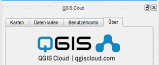

Übung 1 - optional
==========

.. hint::

   Ziel der Übung
      * Die ersten Schritte zum Webmapping
      * Die Benutzeroberfläche von qgis2web kennenlernen

.. important::

   Für Ihre Firma soll in die Internetpräsenz eine interaktive Karte eingebaut werden. Die von der Firma beauftragten Web-Entwickler/innen erwarten eine fertige Struktur, 
   die per Link aufgerufen werden kann. Die Lösung ist ein web-basierter Geoviewer der als Client-Lösung responsiv über einen Browser läuft. Hierfür gibt es mehrere Möglichkeiten.
   Wir werden uns in dieser und in den kommenden Aufgaben mit *OpenLayers*, *Leaflet* und dem *Masterportal* beschäftigen.

.. note::

   **Für diese Übung nutzen wir folgende Tools**
      *  `QGIS <https://qgis.org/>`__
      *  `Plugin *qgis2web* <https://plugins.qgis.org/plugins/qgis2web/>`__
      *  `QGIS Cloud <https://qgiscloud.com/de/pages/quickstart>`__

Aufgabe
--------

Eine Karte mit QGIS Cloud veröffentlichen (Cloud Service)

Es gibt die Möglichkeit (ohne einen eigenen Server betreiben zu müssen) Karten zu veröffentlichen Dies hat den Vorteil, dass keine tieferen WebGIS-Kenntnisse erforderlich sind und dies schnell und einfach geht. 
Die Schweizer Firma Sourcepole bietet einen Cloud-Dienst an, der für einen geringen Speicherbedarf kostenlos nutzbar ist. Dazu gibt es das QGIS-Plugin *QGIS Cloud*.

Nach einer Registrierung können wir eine kleine Webmap über diesen Cloud-Dienst veröffentlichen. Nutzen Sie das ursprüngliche Projekt und speichern Sie es unter einem neuen Namen ab.

- Installieren Sie das Plugin *QGIS Cloud*
- Loggen Sie sich ein (Registrierung dauert ca. 2 min)
- Folgen Si den Anweisungen des `Quickstart - QGIS Cloud <https://qgiscloud.com/de/pages/quickstart>`__
- Publishen Sie das Projekt
- Untersuchen Sie jetzt die Quelle der Layer

   *qgis cloud* Plugin

