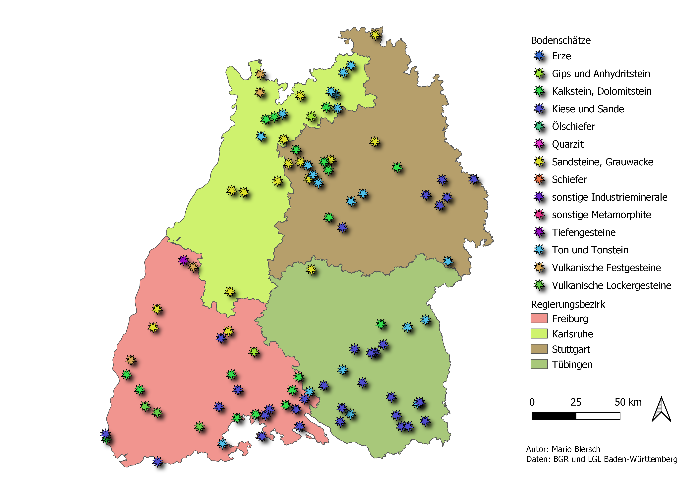

Exercise 2
==========

.. hint::

   Ziel der Übung
      * Eigene Vektorsignaturen gestalten
      * Eine Karte gestalten und typische Elemente wie Legenden, Nordpfeile und Maßstabsleisten hinzufügen.
      * Eine Karte als PDF-Dokument exportieren

.. note::

   **Support findest du im Wiki**
      *  `Vektorsignaturen <https://courses.gistools.geog.uni-heidelberg.de/giscience/gis-einfuehrung/wikis/qgis-Vektorsignaturen>`__
      *  `Kartengestaltung <https://courses.gistools.geog.uni-heidelberg.de/giscience/gis-einfuehrung/wikis/qgis-Kartengestaltung>`__

.. seealso::

   Daten
      *  Punkt-Layer - Bodenschätze Punkte (`Bundesanstalt für Geowissenschaften und Rohstoffe (BGR) <https://services.bgr.de/atomfeeds/dataset_e2ea5cd4-87f4-4751-980a-3451fe2f5758.xml>`__)
      *  Polygon-Layer - Landesgrenze (`Landesamt für Geoinformation und Landentwicklung <https://www.lgl-bw.de/Produkte/Open-Data/>`__)

Aufgaben
--------

Für deine Bachelor-Arbeit willst du eine einfach Karte erstellen, die einen Überblick zu deinen relevanten Daten liefert.

1. Öffne die oben angegebenen Dateien in QGIS.
2. Wähle für das Punkt-Layer eine passende Symbologie.
3. Ändere das Koordinatenbezugssystem (Projektion) eurer Ansicht auf ein für Deutschland passenderes.
4. Erstelle eine neue Druckzusammenstellung. Nutzt das Format A4 (Querformat) für eure Karte.
5. Stelle einen passenden Maßstab ein (z.B. 1:2000000).
6. Versehe deine Karte mit Nordpfeil und Maßstab (Maßstabsbalken und Numerischen Maßstab).
7. Füge abschließend Legende, Autor und Datenquelle(n) hinzu.
8. Speicher deine Karte als PDF.

So (oder ähnlich) kann das Ergebnis aussehen
-------------------------------------

   Einfache Karte der Bidenschätze in Baden-Württemberg. Quelle: Eigene Erhebung mit Daten des LGL & des BGR.