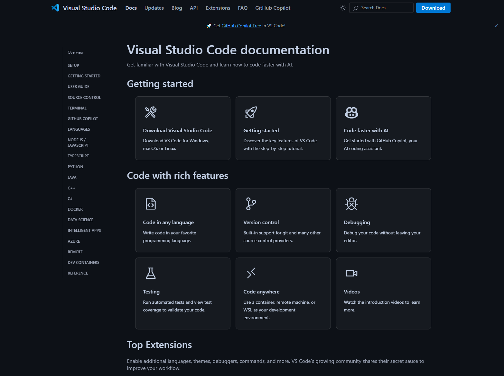

Übung 3 - Konfiguration
==========

.. hint::

   Ziel der Übung
      * Erste Einblicke in *Visual Studio Code* 
      * Die Extension *Live Server* kennenlernen

   `Visual Studio Code <https://code.visualstudio.com/>`__
 

.. seealso::

      *  `Visual Studio Code <https://code.visualstudio.com/>`__
      *  `Live Server <https://marketplace.visualstudio.com/items?itemName=ritwickdey.LiveServer>`__

Masterportal konfigurieren
===========
Jetzt haben wir alle Vorbereitungen getroffen und können mit der Entwicklung bzw. Konfiguration unseres Masterportal-WebGIS starten.

I. Vorbereitung
-----------

Installiere dier die Extension *Live Server* (falls noch nicht geschehen)

.. figure:: img/vs_code_live_server.PNG
   :alt: Visual Studio Code
   :width: 800px

   `Visual Studio Extension *Live Server* <https://marketplace.visualstudio.com/items?itemName=ritwickdey.LiveServer>`__

1. `Lade dir die vorbereitenten NUTS-Daten von eurostat via ILIAS herunter <https://bitbucket.org/geowerkstatt-hamburg/masterportal/downloads/>`__
2. Öffne QGIS
3. Selektiere eine Gemeinde, Landkreis oder Region deiner Wahl & exportiere dir das Feature (bspw. Tübingen)
4. Berechne die *Bounding box* deiner Region
5. Lass dir den *Centroid* der berechneten *Bounding box* ausgeben.
6. Notiere dir die Koordinaten der Bounding box & des Centroid
7. Lade dir drei WMS-Layer für deine Region -> bspw.: 1x Schummerung, 1x Orthophoto, 1x basemap.de
8. Speichere dein Projekt & lasse dein QGIS-Projekt geöffnet

.. figure:: img/masterportal_folder_order.PNG
   :alt: QGIS-Projekt mit *Bounding box* oder *Extent* & *Centroid*
   :width: 800px

   QGIS-Projekt mit *Bounding box* oder *Extent* & *Centroid*
 