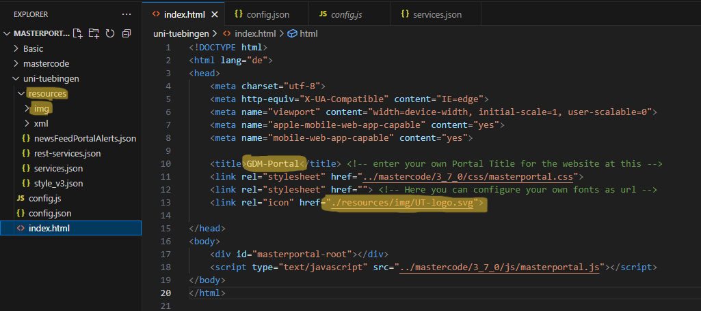
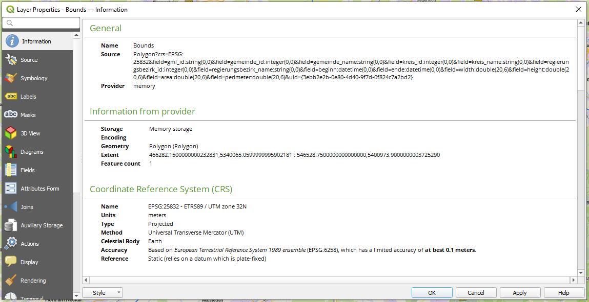
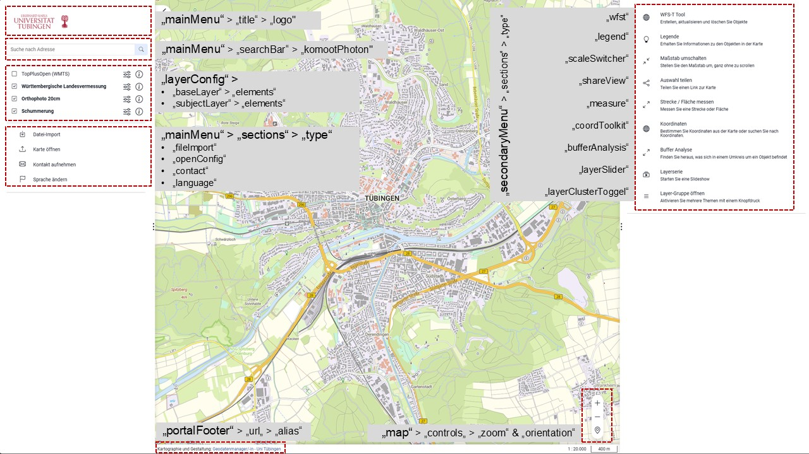

==========
Geoviewer konfigurieren
==========

.. hint::

   Ziel der Übung
      * Die Codestruktur des Masterportals kennenlernen 
      * Einen schlanken Geoviewer individuell zu konfigureren

.. seealso::

      *  `Visual Studio Code <https://code.visualstudio.com/>`__
      *  `Live Server <https://marketplace.visualstudio.com/items?itemName=ritwickdey.LiveServer>`__
      *  `Masterportal Docs <https://www.masterportal.org/mkdocs/doc/v3.7.0/User/About/>`__

Masterportal konfigurieren
===========
Jetzt haben wir alle notwendigen Vorbereitungen getroffen und können mit der Entwicklung bzw. Konfiguration unseres Masterportal-Geoviewer starten.
Ein zentrales Dokument, dass wir für die Konfiguration brauchen ist `die offizielle Dokumentation (Masterportal Docs) <https://www.masterportal.org/mkdocs/doc/v3.7.0/User/About/>`__.
Das *Masterportal example* befindet sich in Hamburg. Die dort eingesetzten Parameter ändern wir jetzt Schritt für Schritt, um aus dem Example unseren eigenen Geoviewer zu konfigurieren.

Titel & Logo ändern
-----------

.. hint::

   Die *index.html* betrifft ausschließlich den Browsertab. Der Masterportal code ist so aufgebaut, dass das meiste, was innerhalb des Browserfensters passiert, in den *Global-* und *Portal-Settings* definiert ist.

Da wir ohnehin die *index.html* Seite offen haben, können wir direkt den Titel und das Logo des Geoviewers im Browsertab ändern.

1. In der *index.html* kannst du den Titel der Seite ändern 
2. Füge eine Logo (fiktiv oder dein Eigenes) in den Ordner *resources/img/logo.svg* (siehe Bild)
3. Füge die Zeile *<link rel="icon" href="./resources/img/logo.svg">* ein und speichere dein Projekt (Strg+S)
4. Das Logo der Universit Tübingen darf aussschließlich von Mitarbeitern verwendet werden. Nutzt einen Dummy: such beu Pixabay oder Google Material Icon. 

.. code-block:: html

   <!DOCTYPE html>
   <html lang="de">
      <head>
         <meta charset="utf-8">
         <meta http-equiv="X-UA-Compatible" content="IE=edge">
         <meta name="viewport" content="width=device-width, initial-scale=1, user-scalable=0">
         <meta name="apple-mobile-web-app-capable" content="yes">
         <meta name="mobile-web-app-capable" content="yes">

         <title>GDM-Portal</title>                                           <!-- enter your own Portal Title for the website at this -->
         <link rel="stylesheet" href="../mastercode/3_7_0/css/masterportal.css">
         <link rel="stylesheet" href="">                                     <!-- Here you can configure your own fonts as url -->
         <link rel="icon" href="./resources/img/UT-logo.svg">                 <!-- Hier kannst du ein Logo im Browsertab einfügen -->

      </head>
      <body>
         

         
      </body>
   </html>

   Angepasster Titel und Logo

4. Öffne nun die Datei *config.json* (bspw. *uni-tuebingen/config.json*)
5. Navigiere zum Abschnitt **"portalFooter"**. Ändere den URL zu einer Website deiner Wahl. Passe den Alias & den mobilen Alias an. Das kann dann bspw. wie folgt aussehen.

.. code-block:: json

   {
    "portalFooter": {
      "urls": [
        {
          "bezeichnung": "common:modules.portalFooter.designation",
          "url": "https://www.geodatenmanagerin-tuebingen.de/termine-anmeldung/",   // Füge deine eigene URL ein
          "alias": "Geodatenmanager/-in - Universität Tübingen",                    // Füge einen Text ein, der für die URL angezeigt werden soll
          "alias_mobil": "GDM"                                                      // Füge einen Text ein, der in der mobilen Version angezeigt werden soll
        }
      ]
    },

Geoviewer anpassen
-----------

Jetzt widmen wir uns dem Kern unseres Geoviewers - der Kartenansicht (engl. Map canvas). Dafür müssen wir die geographische Ausdehnung (*Extent*) & 
den zentralen Startpunkt definieren (*Centroid* oder bspw. das *Geoinstitut*). Dafür nutzen wir die Daten aus der Vorbereitung.

1. Öffne die Datei *config.json* (bspw. *uni-tuebingen/config.json*)
2. Navigiere zum unten aufgeführten Code Bereich `portalConfig <https://www.masterportal.org/mkdocs/doc/v3.7.0/User/Portal-Config/config.json/>`__.

.. code-block:: json

   {
  "portalConfig": {
    "map": {
      "controls": {
        "zoom": true,
        "orientation": {
          "zoomMode": "once"
        }
      },
      "mapView": {
        "backgroundImage": "./resources/img/backgroundCanvas.jpeg",
        "startCenter": [
          561210,
          5932600
        ],
        "extent": [
          510000.0,
          5850000.0,
          625000.4,
          6000000.0
        ],
        "startZoomLevel": 1
      }
    },

Jetzt passen wir in der *config.json* Datei die einzelnen Parameter auf unser Untersuchungsgebiet an.

Startpunkt - **"startCenter"**
"""""""""""

Wir starten mit dem `zentralen Startpunkt <https://www.masterportal.org/mkdocs/doc/v3.7.0/User/Portal-Config/config.json.de/#datatypescoordinate>`__.
Dafür nutzen wir die Koordinaten, die wir in QGIS vorbereitet haben.

   QGIS Layer Eigenschaften mit Extent & EPSG

3. Füge die Koordinaten deines Centroids oder deines zentralen Interessenpunkts (bspw. Geoinstitut) in den Code ein.

   .. raw:: html

      

   .. raw:: html

      

   Hinweis

   .. raw:: html

      

   .. raw:: html

      <ul>

   .. raw:: html

      <li>

   Siehe **"startCenter"**. Die erste Koordinate repräsentiert den Rechtswert, die zweite den Hochwert.

.. code-block:: json

   {
      "mapView": {
        "backgroundImage": "./resources/img/backgroundCanvas.jpeg",
        "startCenter": [
          504116.11181222,
          5374563.32233909
        ],
        "extent": [
          510000.0,
          5850000.0,
          625000.4,
          6000000.0
        ],
        "startZoomLevel": 1
      }
    },

Ausdehnung - **"extent"**
"""""""""""

4. Als nächstes definieren wir den geographischen Rahmen (**Extent** bzw. **Bbox**) unseres Geoviewers

   .. raw:: html

      

   .. raw:: html

      

   Hinweis

   .. raw:: html

      

   .. raw:: html

      <ul>

   .. raw:: html

      <li>

   Ein Extent besteht aus einem Array bestehend aus vier Zahlen. Ein Extent beschreibt einen rechteckigen Gültigkeitsbereich. Dabei wird ein Rechteck aufgespannt, 
   das durch die "linke untere" und die "rechte obere" Ecke definiert wird. Das Schema lautet [Hochwert-Links-Unten, Rechtswert-Links-Unten, Hochwert-Rechts-Oben, 
   Rechtswert-Rechts-Oben] oder [minx, miny, maxx, maxy]. Quelle: `Masterportal Docs <https://www.masterportal.org/mkdocs/doc/v3.7.0/User/Portal-Config/config.json.de/#datatypesextent>`__.

.. code-block:: json

   {
      "mapView": {
        "backgroundImage": "./resources/img/backgroundCanvas.jpeg",
        "startCenter": [
          504127.9130919434828684,
          5374562.7627044897526503
        ],
        "extent": [466282.1500000000232831, 5340065.0599999995902181, 546528.7500000000000000, 5400973.9000000003725290],
        "StartZoomLevel": 1,
        "epsg": "EPSG:25832"
      }
    },

.. hint::

   Achte auf die Projektion (EPSG), die du benutzt. Welche Projektion ist für dich die Richtige?

**Speichere dein Projekt und schaue dir die Änderungen in deinem Browserfenster an.** 

**Gratulation! Die Karte sollte jetzt angepasst sein**

Werkzeuge - **"secondaryMenu"**
"""""""""""
 
Das **"secondaryMenu"** ist die Toolbox bzw. Werkzeugkiste des Masterportals. Es bezieht sich auf das Navigationsfenster, dass man im rechten Bereich finden kann.

Als erstes wollen wir Werkzeuge löschen, die wir nicht benötigen. Lösche folgenden Codeabschnitt & speichere dein Projekt.

 .. code-block:: json

          {
            "type": "bufferAnalysis"
          },

Durch das Anpassen dieses bereiches kannst du definieren, welche Werkzeuge in deinem Geoviewer zur Verfügung stehen sollen.

Navigationsfenster - **"mainMenu"**
"""""""""""

Lösche im Abschnitt **"sections"** folgendes

 .. code-block:: json

          {
            "type": "openConfig"
          },
         {
            "type": "language"
          }

Speichere deine Datei und sieh dir die Veränderungen im Geoviewer an. Was hat sich geändert?

Überblick *config.json*
-----------

In der folgenden Abbildung kannst du dir einen Überblick verschaffen, welche Code-Abschnitt der *config.json* für welche Bereiche des Geoviewers zuständig sind.

   Geoviewer und Masterportal *config.json* kombiniert

Weitere nützliche Werkzeuge (Tools)  *config.json*
-----------

Ansicht teilen (Share view)
"""""""""""

 .. code-block:: json

         {
            "icon": "bi-share",
            "name": "common:modules.shareView.name",
            "type": "shareView",
            "facebookShare": false,
            "qrShare": true
         }

Geoobjekte (Features) erstellen, bearbeiten und/oder löschen
"""""""""""

.. code-block:: json

          {
            "type": "wfst",
            "name": "WFS-T Tool",
            "layerIds": [
              "lgvline",
              "lgvpoint",
              "lgvpolygon"
            ],
            "toggleLayer": false,
            "lineButton": [
              {
                "layerId": "lgvline",
                "available": true
              }
            ],
            "pointButton": [
              {
                "layerId": "lgvpoint",
                "available": true
              }
            ],
            "polygonButton": [
              {
                "layerId": "lgvpolygon",
                "available": true
              }
            ],
            "update": "Bearbeiten!",
            "delete": true
          }

Geoobjekte auswählen & anzoomen
"""""""""""

.. code-block:: json

         {
            "type": "selectFeatures",
            "highlightVectorRulesPolygon": {
                "fill": {
                    "color": [255, 0, 255, 0.9]
                },
                "stroke": {
                    "width": 4,
                    "color": [0, 0, 204, 0.9]
                },
                "zoomLevel": 5
            },
            "highlightVectorRulesPointLine": {
                "fill": {
                    "color": [255, 0, 255, 0.9]
                },
                "stroke": {
                    "width": 8,
                    "color": [255, 0, 255, 0.9]
                },
                "image": {
                    "scale": 2
                },
                "zoomLevel": 5
            }
        }