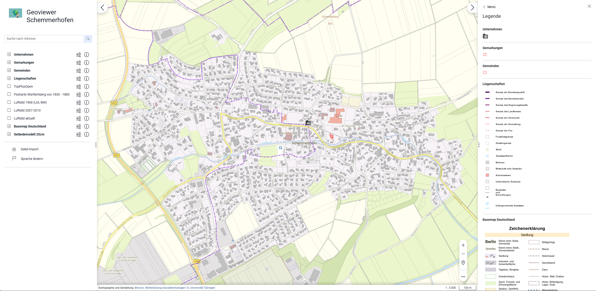

==========
Geodaten implementieren
==========

.. hint::

   Ziel der Übung
      * Erste Einblicke in *Visual Studio Code* 
      * Die Extension *Live Server* kennenlernen

.. seealso::

      *  `Visual Studio Code <https://code.visualstudio.com/>`__
      *  `Live Server <https://marketplace.visualstudio.com/items?itemName=ritwickdey.LiveServer>`__

OGC-Deinste konfigurieren & implementieren
===========
Wir haben jetzt die Vorbereitungen und die individuelle Konfiguration unseres Geoviewers abgeschlossen. Jetzt fehlen noch die passenden Layer, die wir in unserem Geoviewer angezeigt haben möchten.
Die Dienste und Layer können wir in der Datei *services.json* anpassen. Es wirkt auf den ersten Blick sehr verwirrend, aber wir werden uns Schritt für Schritt dem Aufbau nähern & konfigurieren.
Wir können in *services.json* eine ganze Reihe von OGC-Diensten einbinden. Allerdings müssen wir dies im Anschluss wieder auf in der *config.json* verlinken, 
damit dieser Layer im Geoviewer angezeigt wird.

.. attention::

   In der *service.json* erstellen wir die Verbindungen zu den OGC-Diensten. Im *config.json* implementieren wir die Layer in den Geoviewer.

Hintergrundkarte
"""""""""""

Beginnen wir mit einer Hintergrundkarte, die wir als WMS-Layer einbinden.

1. Fügen Sie folgenden Code Abschnitt oben  nach der [ ein

   .. raw:: html

      

   .. raw:: html

      

   Hinweis

   .. raw:: html

      

   .. raw:: html

      <ul>

   .. raw:: html

      <li>

   Es ist hilfreich den gewünschten WMS-Layer in QGIS zu testen und über die QGIS Layer Properties die URLs für die Masterportal WMS-Layer Vorlage (siehe unten) zu kopieren.

.. code-block:: json

   {
            "id": "102",
            "name": "Basemap (BKG) Germany",
            "url": "https://sgx.geodatenzentrum.de/wms_basemapde",
            "typ": "WMS",
            "layers": "de_basemapde_web_raster_farbe",
            "format": "image/png",
           "version": "1.3.0",
           "singleTile": false,
            "transparent": true,
            "transparency": 0,
            "urlIsVisible": true,
            "tilesize": 512,
            "gutter": 0,
            "minScale": "0",
            "maxScale": "62304136",
            "infoFormat": "text/xml",
            "gfiAttributes": "showAll",
            "gfiTheme": "default",
            "layerAttribution": "nicht vorhanden",
            "legendURL": "https://sgx.geodatenzentrum.de/wms_basemapde?format=image/png&layer=de_basemapde_web_raster_farbe&sld_version=1.1.0&request=GetLegendGraphic&service=WMS&version=1.1.1&styles=&",
            "cache": false,
            "featureCount": 1,
            "datasets": [
              {
                "md_id": "69264016-D304-4DD6-BCEF-509C1ED19F14",
                "csw_url": "https://mis.bkg.bund.de/csw?REQUEST=GetRecordById&SERVICE=CSW&VERSION=2.0.2&id=69264016-D304-4DD6-BCEF-509C1ED19F14",
                "show_doc_url": "",
                "rs_id": "",
                "md_name": "Basemap (BKG) Germany",
                "bbox": "-180.0000000000000000,-85.0511287798066036, 180.0000000000000000,85.0511287798066036",
              "kategorie_opendata" : [
                "Map"
              ],
              "kategorie_inspire" : [
                "INSPIRE-identifiziert"
              ],
              "kategorie_organisation" : "BKG"
              }
            ],
            "notSupportedIn3D": false
    },

Jetzt wollen wir noch eine weitere Hintergrundkarte als WMTS-Layer einbinden.

.. code-block:: json

  {
    "id": "topplus_wmts",
    "name": "TopPlusOpen",
    "capabilitiesUrl": "https://sgx.geodatenzentrum.de/wmts_topplus_open/1.0.0/WMTSCapabilities.xml",
    "optionsFromCapabilities": true,
    "urls": [
      "https://sgx.geodatenzentrum.de/wmts_topplus_open/tile/1.0.0/web/{Style}/{TileMatrixSet}/{TileMatrix}/{TileRow}/{TileCol}.png"
    ],
    "typ": "WMTS",
    "layers": "web",
    "format": "image/png",
    "version": "1.0.0",
    "origin": [
      -3803165.98427,
      8805908.08285
    ],
    "isBaseLayer": true,
    "style": "default",
    "transparent": false,
    "tileSize": "256",
    "minScale": "0",
    "maxScale": "9999999999",
    "tileMatrixSet": "EU_EPSG_25832_TOPPLUS",
    "coordinateSystem": "EPSG:25832",
    "legend": [
      "https://sg.geodatenzentrum.de/wms_topplus_open?styles=&layer=web&service=WMS&format=image/png&sld_version=1.1.0&request=GetLegendGraphic&version=1.1.1"
    ],
    "requestEncoding": "REST",
    "resLength": "13",
    "layerAttribution": "Quellenvermerk: © Bundesamt für Kartographie und Geodäsie",
    "datasets": [
      {
        "md_id": "A1C4E929-3EC9-4758-9677-DB4970D226AB",
        "csw_url": " https://gdk.gdi-de.org/gdi-de/srv/ger/csw?",
        "show_doc_url": "https://gdk.gdi-de.org/gdi-de/srv/ger/catalog.search#/metadata/"
      }
    ]
  },

Vorlagen zur Einbindung von WMS- & WMTS-Layern finden sich auch in `der offizielle Dokumentation (Masterportal Docs) <https://www.masterportal.org/mkdocs/doc/v3.7.0/User/Global-Config/services.json/#wms-layer>`__.

Layer im Geoviewer aktivieren
"""""""""""

.. hint::

   Um die zwei eingebundenen Hintergrundkarten jetzt sichbar machen zu können, müssen wir in der *config.json* unter **"layerConfig"** > **"baseLayer"**  darauf verweisen.
   Der Code Abschnitt kann folgendermaßen aussehen.

.. code-block:: json

      "layerConfig": {
         "baselayer": {
            "elements": [
            {
               "id": "101",
               "visibility": true,
               "name": "Basemap (BKG)"
            },
            {
               "id": "topplus_wmts",
               "visibility": false,
               "name": "TopPlusOpen Hintergrundkarte"
            }
         ]

.. hint::

   Achte auf die Projektion (EPSG), die du benutzt. Welche Projektion ist für dich die Richtige?

   .. raw:: html

      

   .. raw:: html

      

   Hinweis

   .. raw:: html

      

   .. raw:: html

      <ul>

   .. raw:: html

      <li>

   Für Deutschland ist das ETRS89 / UTM 32N bzw. 33N Standard.

**Speichere dein Projekt und schaue dir die Änderungen in deinem Browserfenster an.** 

**Gratulation! Die Karte sollte jetzt angepasst sein**

Beispiel
-----------

So oder do ähnlich kann ein einfacher Geoviewer ausseheb

   Geoviewer Schemmerhofen als Beispiel

Geoportal Hamburg
"""""""""""

.. hint::

      Die Stadt Hamburg zeigt in ihrem Geoportal eine breite Palette an Werkzeugen und Möglichkeiten, die das Masterportal bietet. -> `Geoportal Hamburg <https://geoportal-hamburg.de/?lng=de#>`__

