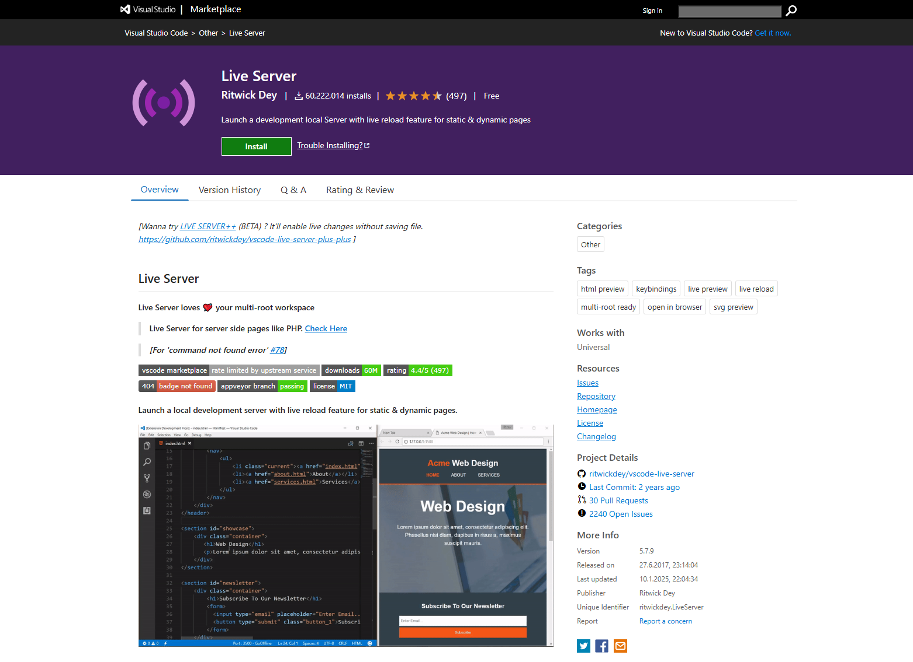
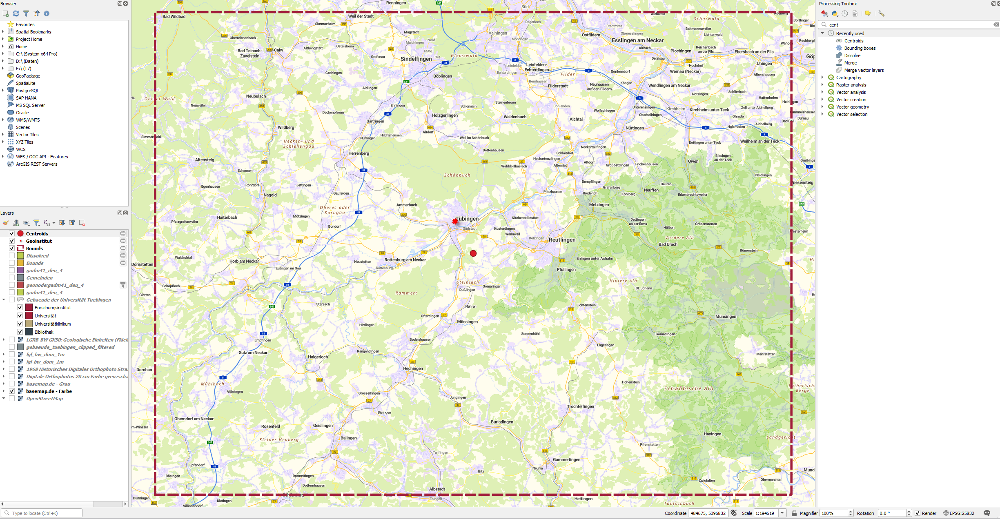
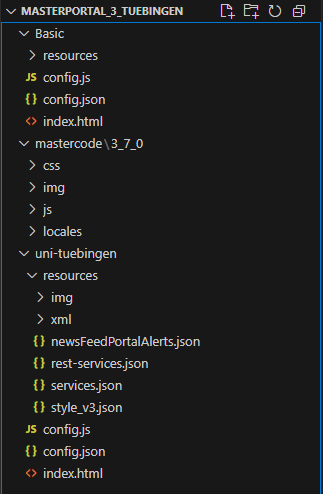
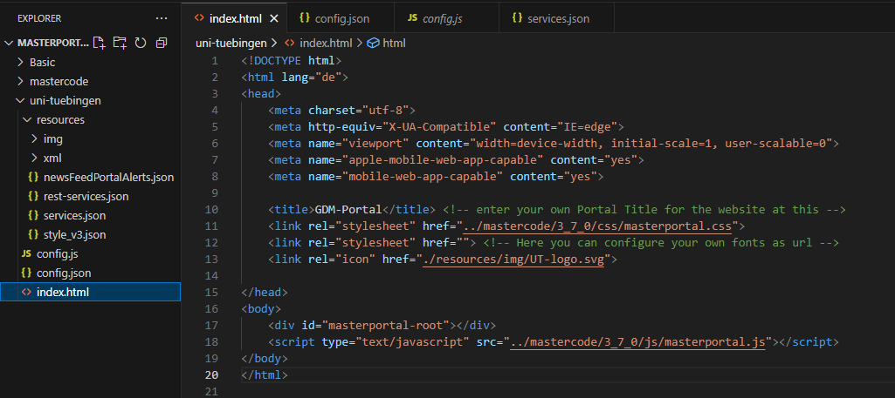
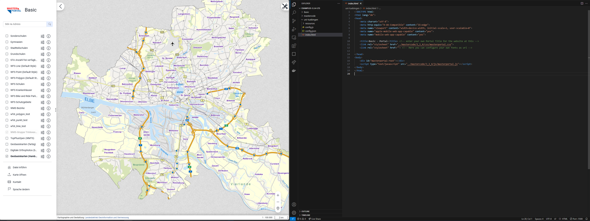

Rahmen vorbereiten
==========

.. hint::

   Ziel der Übung
      * Erste Einblicke in *Visual Studio Code* 
      * Die Extension *Live Server* kennenlernen

.. seealso::

      *  `Visual Studio Code <https://code.visualstudio.com/>`__
      *  `Live Server <https://marketplace.visualstudio.com/items?itemName=ritwickdey.LiveServer>`__

Masterportal
~~~~~~~~~~~~~~~~~~~~~~

.. raw:: html

   <video width="100%" controls src="https://www.masterportal.org/fileadmin/content/videos/Video_1_Masterportal_Vorstellung.mp4">

.. raw:: html

   </video>

Quelle: `Masterportal <https://www.masterportal.org/media/videos>`__

Schritt für Schritt Richtung eigenes WebGIS
===========
Um ein eigenes WebGIS mit Masterportal zu erstellen, gehen wir in drei Schritten vor. Zuerst bereiten wir alle Informationen vor, die wir für unser Untersuchungsgebiet benötigen. 
Im Anschluss bereiten wir unsere Entwicklungsumgebung vor. Dann werden wir die Karte, die Werkzeuge, den Footer und das Logo anpassen. 

Vorbereitung
-----------

Installiere dier die Extension *Live Server* (falls noch nicht geschehen)

   `Visual Studio Extension *Live Server* <https://marketplace.visualstudio.com/items?itemName=ritwickdey.LiveServer>`__

1. `Lade dir die vorbereitenten NUTS-Daten von eurostat via ILIAS herunter <https://bitbucket.org/geowerkstatt-hamburg/masterportal/downloads/>`__
2. Öffne QGIS
3. Selektiere eine Gemeinde, Landkreis oder Region deiner Wahl & exportiere dir das Feature (bspw. Tübingen)
4. Berechne die *Bounding box* deiner Region
5. Lass dir den *Centroid* der berechneten *Bounding box* ausgeben.
6. Notiere dir die Koordinaten der Bounding box & des Centroid
7. Reprojiziere die Koordinaten der *Bounding box* in WGS 84 - WGC. Notiere dir die Koordinaten ebenfalls
7. Lade dir drei WMS-Layer für deine Region -> bspw.: 1x Schummerung, 1x Orthophoto, 1x basemap.de
8. Speichere dein Projekt & lasse dein QGIS-Projekt geöffnet

   QGIS-Projekt mit *Bounding box* oder *Extent* & *Centroid*

Masterportal herunterladen & einbinden
-----------

1. `Ladet euch das Masterportal example herunter <https://bitbucket.org/geowerkstatt-hamburg/masterportal/downloads/>`__
2. Innerhalb des Masterportal_example Ordners findest du einen Ordner *Basic*. Kopiere diesen und bennene ihn passend zu deinem Untersuchungsgebiet um (bspw. uni-tuebingen).

3. Öffne in Visual Studio Code deinen Masterportal example Ordner

   .. raw:: html

      

   .. raw:: html

      

   Hinweis

   .. raw:: html

      

   .. raw:: html

      <ul>

   .. raw:: html

      <li>

   Der Ordner Basic dient als Backup

   Masterportal Ordnerstruktur in Visual Studio

4. Öffne die *index.html* Datei

   .. raw:: html

      

   .. raw:: html

      

   Hinweis

   .. raw:: html

      

   .. raw:: html

      <ul>

   .. raw:: html

      <li>

   Durch einfaches anklicken de *index.html*

5. So (oder so ähnlich) sollte dein Visual Studio Code jetzt aussehen
 

   Masterportal *index.html* in Visual Studio

6. Starte mit dem *Live Server* die *index.html* Datei

   .. raw:: html

      

   .. raw:: html

      

   Hinweis

   .. raw:: html

      

   .. raw:: html

      <ul>

   .. raw:: html

      <li>

   Rechtsklick in die *index.html* und dann **Open with Live Server** wählen

   Masterportal *index.html* in Visual Studio

 