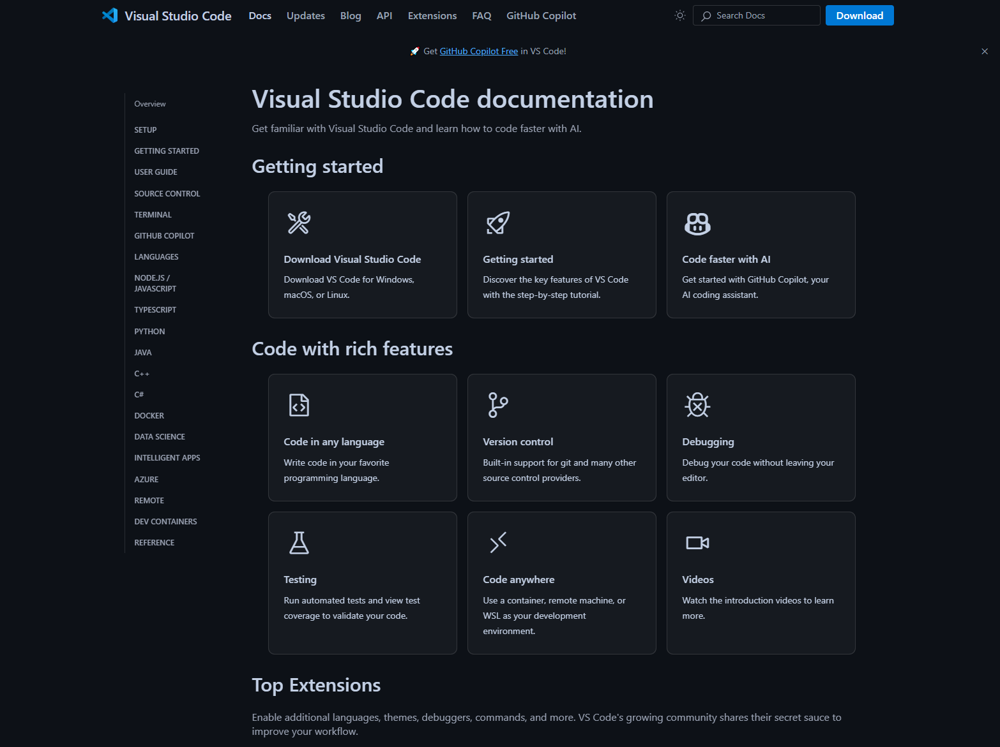

Visual Studio Code
==========

.. hint::

   Ziel der Übung
      * Erste Einblicke in *Visual Studio Code* 
      * Die Extension *Live Server* kennenlernen

   `Visual Studio Code <https://code.visualstudio.com/>`__
 

.. seealso::

      *  `Visual Studio Code <https://code.visualstudio.com/>`__
      *  `Live Server <https://marketplace.visualstudio.com/items?itemName=ritwickdey.LiveServer>`__

Schritt für Schritt Richtung eigenes WebGIS
===========

Vorbereitung
-----------

1. `Lade dir die vorbereitenten NUTS-Daten von eurostat via ILIAS herunter <https://bitbucket.org/geowerkstatt-hamburg/masterportal/downloads/>`__
2. Öffne QGIS
3. Selektiere eine Gemeinde, Landkreis oder Region deiner Wahl & exportiere dir das Feature (bspw. Tübingen)
4. Berechne die *Bounding box* deiner Region
5. Lass dir den *Centroid* der berechneten *Bounding box* ausgeben.
6. Notiere dir die Koordinaten der Bounding box & des Centroid
7. Lade dir drei WMS-Layer für deine Region -> bspw.: 1x Schummerung, 1x Orthophoto, 1x basemap.de
8. Speichere dein Projekt

Visual Studio Code einbinden
-----------

- `Ladet euch das Masterportal example herunter <https://bitbucket.org/geowerkstatt-hamburg/masterportal/downloads/>`__
- Installiere dier die Extension *Live Server*
- Öffne in Visual Studio Code den Masterportal example Ordner

.. figure:: img/vs_code_live_server.PNG
   :alt: Visual Studio Code
   :width: 800px

   `Visual Studio Extension *Live Server* <https://marketplace.visualstudio.com/items?itemName=ritwickdey.LiveServer>`__
 