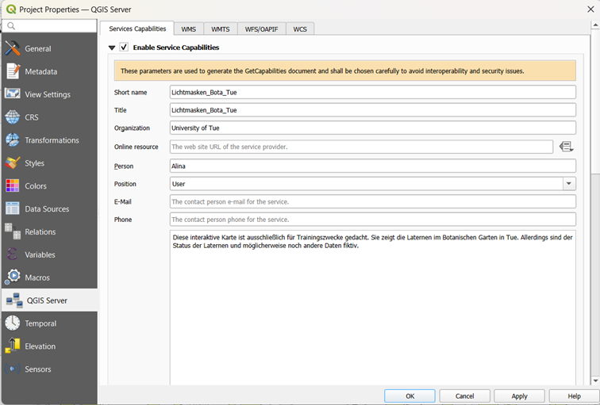

WFS erstellen
==========

.. hint::

   Ziel der Übung
      * WFS - OGC-Dienst veröffentlichen 
      * Eigene OGC-Dienste mit QGIS-Server publizieren
      * Mit FileZilla Daten übertragen

.. seealso::

      *  `OGC <https://www.ogc.org/de/>`__
      *  `QGIS Server <https://docs.qgis.org/3.40/en/docs/server_manual/index.html>`__
      *  `OGC-Dienste - Basics <https://docs.qgis.org/3.40/en/docs/server_manual/services/basics.html>`__
      *  `FileZilla <https://filezilla-project.org/>`__

WFS/OAPIF erstellen
--------

**WFS = Web Feature Service**

**OAPIF = OGC API for Features**

In QGIS Server sind WMS und WFS/OAPIF zwei unterschiedliche Arten um Daten bereitzustellen. Wann sollten Sie WMS und wann WFS/OAPIF verwenden?
WMS (Web Map Service)
•	liefert nur Kartenbilder (PNG/JPEG) 
•	gut für Visualisierung 
•	schnell und einfach 
•	Nutzer können die Daten nicht direkt herunterladen oder bearbeiten 
•	Abfragen sind meist nur „zeige mir diese Karte in diesem Ausschnitt“ 

*Ideal für Webkarten-Hintergründe, Viewer, schnelle Darstellung.*

WFS (Web Feature Service) / OAPIF
--------

•	liefert echte Vektordaten (Features: Punkte, Linien, Polygone + Attribute) 
•	Nutzer können Daten abfragen, filtern, herunterladen 
•	je nach Konfiguration auch editieren (Update/Insert/Delete) 
•	wird oft für Analyse oder Datenintegration genutzt 

*Ideal, wenn andere Systeme deine Geodaten wirklich verwenden sollen, nicht nur anschauen.*

Warum OAPIF?
--------

OAPIF (OGC API Features) ist die modernere (.json) Nachfolger von WFS:

•	einfacher über HTTP/JSON nutzbar 
•	besser geeignet für Webentwicklung 
•	moderner Standard (REST-ähnlich) 

*Zukunftssicherer als klassischer WFS.*

Kurz gesagt: Wann was?
====== 

•	Nur anschauen / Karte anzeigen → WMS 
•	Daten abrufen / GIS-Analyse / Download → WFS/OAPIF 
•	Daten bearbeiten über Web/GIS → WFS mit Schreibrechten 

Viele Server (bspw. QGIS Server oder GeoServer) bieten beides gleichzeitig an - WMS für die Darstellung und WFS für die Datennutzung.

Die WFS/OAPIF-Datei können Sie wie bei der WMS-Datei in QGIS über Projekt Eigenschaften  QGIS Server erstellen. Dafür müssen wie gewohnt die Service Capabilities und WMS dem Datensatz entsprechend ausgefüllt werden.

   QGIS Server Plugin in QGIS - Service Capabilities

   QGIS Server Plugin in QGIS - WMS definieren

Diesmal wird allerdings nicht der Reiter WMS, sondern der Reiter WFS/OAPIF 
bearbeitet. Dieser ist Ihnen vielleicht bereits bei der Erstellung der 
WMS-Datei aufgefallen und vielleicht haben Sie sich schon gefragt, was 
genau sich hinter Layer, Publizieren, Geometriegenauigkeit, Update, 
Einfügen und Löschen verbirgt. Darauf wird im Folgenden etwas genauer 
eingegangen.

   QGIS Server Plugin in QGIS - WFS/OAPIF definieren

Published
--------

Unter Published können Sie auswählen, ob der Layer in der WFS/OAPIF-Datei veröffentlich wird oder nicht.

Wenn aktiviert:

•	der Layer wird über WFS/OAPIF veröffentlicht 
•	Clients können ihn als Feature-Layer abrufen 

Wenn nicht aktiviert:
•	Layer existiert im Projekt, aber nicht als WFS/OAPIF Service 

Geometry precision
--------

Die Geometry precision bestimmt, mit wie vielen Dezimalstellen die Koordinaten ausgeliefert werden. Das kann sinnvoll sein, um die Datenmenge zu reduzieren oder Geometrien leichter zu generalisieren.
Beispiel:
•	8 Dezimalstellen = extrem genau (auf cm/mm Ebene bei WGS84) 
•	weniger Dezimalstellen = weniger Datenvolumen, schnellere Übertragung 

Update
--------

Erlaubt, dass ein Client bestehende Features verändern darf und somit einen Schreibzugriff hat oder auch nicht.
Beispiel:

•	Attribut ändern 
•	Geometrie verschieben 

Insert
--------

Erlaubt, dass ein Client neue Features (Datensätze) hinzufügen darf.
Beispiel:

•	Neuer Lichtmast als Punkt erfassen bzw. hinzufügen 

Delete
--------

Erlaubt, dass ein Client (bspw. in QGIS) Features (Datensätze) löschen darf.

Was kann man damit machen (praktisch)?
--------

Wenn du WFS mit Insert/Update/Delete aktivierst, könnten Nutzer z.B.:

•	WFS -T = Transaction (OCG Standard)
•	über QGIS direkt auf deinen Serverlayer zugreifen 
•	Features editieren wie bei einer Datenbank 
•	Änderungen speichern → landen im Backend

Das ist sehr mächtig, aber auch riskant.

Wichtiger Hinweis (Sicherheit)
--------

Wenn du Update/Insert/Delete aktivierst, solltest du unbedingt:

•	Benutzerrechte sauber regeln 
•	Authentifizierung nutzen 
•	Datenbankrechte einschränken 
•	Logging/Backup haben 

Sonst könnte theoretisch jemand Daten löschen oder verfälschen.

Fazit
--------

•	WMS: für Kartenbilder (sicher, schnell, Karte wird angezeigt) 
•	WFS/OAPIF: für echte Geodaten (Analyse, Download, ggf. Editieren) 
