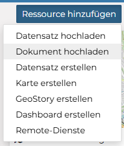
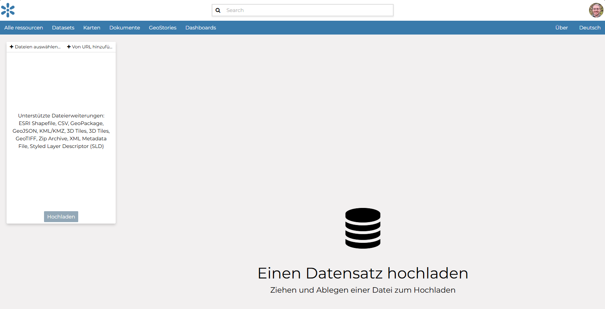
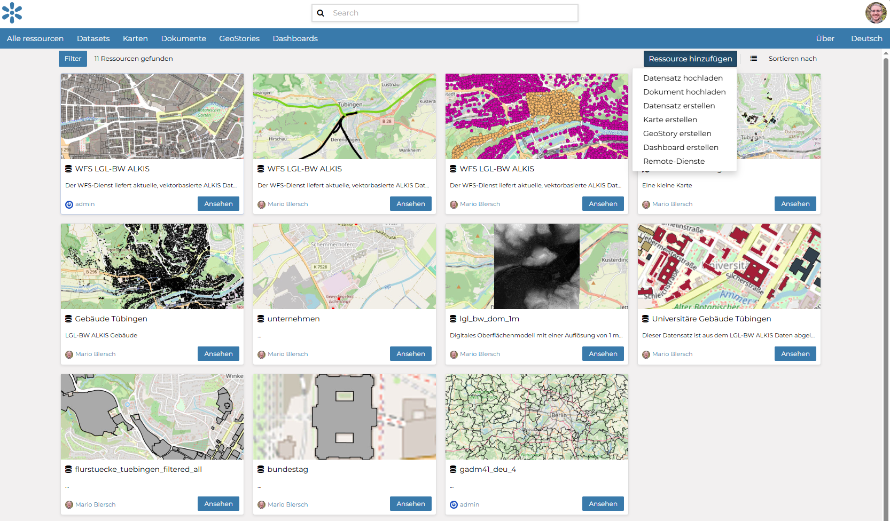

Daten hochladen
========

Die in GeoNode integrierten Datenverwaltungstools ermöglichen die Erstellung von Ressourcen wie Datensätzen, Dokumenten, Links zu externen Dokumenten, Kartenvisualisierungen und 
anderen konfigurierten GeoNode-Apps. Jede Ressource im System kann öffentlich geteilt oder eingeschränkt werden, um den Zugriff nur bestimmten Benutzern zu ermöglichen. 
Soziale Funktionen wie Benutzerprofile sowie Kommentar- und Bewertungssysteme ermöglichen die Entwicklung von Gemeinschaften rund um jede Plattform, um die Nutzung, 
Verwaltung und Qualitätskontrolle der in der GeoNode-Instanz enthaltenen Daten zu erleichtern.
.. hint::

   Ziel der Übung
      * GeoNode kennenlernen 
      * Eigene Daten hochladen

.. seealso::

      *  `GeoNode - Datensätze organisieren <https://docs.geonode.org/en/master/usage/managing_datasets/using_remote_services.html>`__

.. hint::

      Es gibt fünf Haupttypen von Ressourcen, die GeoNode verwalten kann:

         - Datensätze
         - Karten
         - Dokumente
         - GeoStories
         - Dashboards

         Jeder Ressourcentyp hat sein eigenes Menü und kann über die Schaltflächen Datensätze, Karten, Dokumente, GeoStories und Dashboards in der Navigationsleiste erreicht werden.

Aufgabe
--------
Wir wollen erste Geodaten hochladen. Das machen wir zu Beginn über die GeoNode-Plattform selbst.

1. Gehe auf das Feld *Alle Ressourcen* (links oben)

   Quelle: Eigene Erhebung

2. Nutze das Symbol *Ressource hinzufügen*
3. Wähle *Datensatz hochladen*

   Quelle: Eigene Erhebung

   Quelle: Eigene Erhebung

Datentypen
--------------

Die Willkommensseite von GeoNode zeigt eine Vielzahl von Informationen über die aktuelle GeoNode-Instanz. Du kannst die vorhandenen Daten mit vielen Suchwerkzeugen und Filtern 
durchsuchen oder über die Links in der Navigationsleiste oben auf der Seite. Es gibt fünf Haupttypen von Ressourcen, die GeoNode verwalten kann:

- Datensätze
- Karten
- Dokumente
- GeoStories
- Dashboards

Jeder Ressourcentyp hat sein eigenes Menü und kann über die Schaltflächen Datensätze, Karten, Dokumente, GeoStories und Dashboards in der Navigationsleiste erreicht werden.

Datensätze
^^^^^^^^^^^^^^

Datensätze sind ein Hauptbestandteil von GeoNode. Datensätze sind veröffentlichbare Ressourcen, die eine Raster- oder Vektorraumbasisdatenquelle darstellen. 
Datensätze können auch mit Metadaten, Bewertungen und Kommentaren verknüpft werden. Durch Klicken auf den Link Datensätze erhältst du eine Liste aller veröffentlichten Datensätze. 
Wenn du als Administrator angemeldet bist, siehst du in derselben Liste auch die unveröffentlichten Datensätze. GeoNode ermöglicht es dem Benutzer, Vektor- und Rasterdaten in 
ihren ursprünglichen Projektionen über ein Webformular hochzuladen. Vektordaten können in vielen verschiedenen Formaten hochgeladen werden (ESRI Shapefile, KML usw.). 
Satellitenbilder und andere Arten von Rasterdaten können als GeoTIFFs hochgeladen werden.

Karten 
^^^^^^^^^^^^^^

Karten sind ein Hauptbestandteil von GeoNode. Karten bestehen aus verschiedenen Datensätzen und deren Stilen. Datensätze können sowohl lokale Datensätze in GeoNode als auch 
entfernte Datensätze sein, die entweder von anderen WMS-Servern oder von Webdienst-Datensätzen wie Google oder MapQuest bereitgestellt werden. 
GeoNode-Karten enthalten auch andere Informationen wie Kartenzoom und -ausdehnung, Datensatzreihenfolge und Stil.

Du kannst eine Karte basierend auf hochgeladenen Datensätzen erstellen, sie mit einigen vorhandenen Datensätzen und einem entfernten Webdienst-Datensatz kombinieren und die 
resultierende Karte zur öffentlichen Ansicht freigeben. Sobald die Daten hochgeladen wurden, ermöglicht GeoNode dem Benutzer, sie geografisch oder über Schlüsselwörter zu suchen 
und Karten zu erstellen. Alle Datensätze werden automatisch in Web Mercator für die Kartendarstellung reprojiziert, wodurch es möglich ist, beliebte Basiskarten wie OpenStreetMap zu verwenden.

Dokumente
^^^^^^^^^^^^^^

GeoNode ermöglicht das Veröffentlichen von tabellarischen und Textdaten sowie das Verwalten von Metadaten und zugehörigen Dokumenten. Dokumente können direkt von deiner 
Festplatte hochgeladen werden (siehe Hochladen/Hinzufügen von Dokumenten für weitere Informationen). Die folgenden Dokumenttypen sind erlaubt: 
txt, .log, .doc, .docx, .ods, .odt, .sld, .qml, .xls, .xlsx, .xml, .bm, .bmp, .dwg, .dxf, .fif, .gif, .jpg, .jpe, .jpeg, .png, .tif, .tiff, .pbm, .odp, .ppt, .pptx, .pdf, .tar, .tgz, .rar, .gz, .7z, .zip, .aif, .aifc, .aiff, .au, .mp3, .mpga, .wav, .afl, .avi, .avs, .fli, .mp2, .mp4, .mpg, .ogg, .webm, .3gp, .flv, .vdo, .glb, .pcd, .gltf. Über die Detailseite des Dokuments ist es möglich, ein Dokument anzuzeigen, herunterzuladen und zu verwalten.

GeoStories 
^^^^^^^^^^^^^^

GeoStory ist ein in GeoNode integriertes MapStore-Tool, das dem Benutzer eine Möglichkeit bietet, inspirierende und immersive Geschichten zu erstellen, indem Text, 
interaktive Karten und andere multimediale Inhalte wie Bilder und Videos oder andere Inhalte von Drittanbietern kombiniert werden. Mit diesem Tool kannst du einfach deine 
Geschichten im Web erzählen und sie dann mit verschiedenen Gruppen von GeoNode-Benutzern teilen oder sie der ganzen Welt öffentlich zugänglich machen.

Dashboard 
^^^^^^^^^^^^^^

Dashboard ist ein in GeoNode integriertes MapStore-Tool, das dem Benutzer einen Raum bietet, um viele Widgets hinzuzufügen, wie Diagramme, Karten, Tabellen, Texte und Zähler und 
Verbindungen zwischen ihnen zu erstellen, um 

- einen Überblick zu bieten, 
- um einen spezifischen Datenkontext besser zu visualisieren
- Räumlich und analytisch mit den Daten zu interagieren, indem Verbindungen zwischen Widgets erstellt werden
- Analysen an den beteiligten Daten/Schichten durchzuführen

`Mehr Informationen findest du hier <https://docs.geonode.org/en/master/usage/data/data_types.html>`__

Daten finden
--------------

Dieser Abschnitt führt dich durch die Navigation in GeoNode, um Datensätze, Karten, Dokumente und andere Ressourcentypen mithilfe verschiedener Routen, 
Filter und Suchfunktionen zu finden. Auf jeder Seite findest du ein schnelles Suchwerkzeug. Das Suchfeld in der Navigationsleiste (siehe Bild unten) ermöglicht es dir, 
einen Text einzugeben und alle Ressourcen zu finden, die mit diesem Text zu tun haben.

.. figure:: https://docs.geonode.org/en/master/_images/search_tool.png
   :alt: GeoNode Suchtool

   Quelle: `Suchtool <https://docs.geonode.org/en/master/usage/accounts_user_profile/new_account/index.html>`__

Wenn du eine Suche startest, wirst du zur Suchseite weitergeleitet, die dir das Suchergebnis für alle Datentypen anzeigt.

.. figure:: https://docs.geonode.org/en/master/_images/search_page.png
   :alt: GeoNode Seite

   Quelle: `Die Seite zum Suchen <https://docs.geonode.org/en/master/usage/accounts_user_profile/new_account/index.html>`__

Diese Seite enthält eine Fülle von Optionen zur Anpassung einer Suche nach verschiedenen Informationen auf GeoNode. Dieses Suchformular ermöglicht feinere Suchvorgänge als das 
einfache Suchfeld, das oben auf jeder Seite verfügbar ist. Es ist möglich, Daten nach Text, Typen, Kategorien, Schlüsselwörtern, Eigentümern, Regionen, Gruppen, Einschränkungen 
des öffentlichen Zugriffs, Datum und Ausdehnung zu suchen und zu filtern. Versuche, einige Filter einzustellen, und sieh, wie sich die resultierende Datenliste entsprechend ändert. Ein interessanter Filtertyp ist AUSDEHNUNG: Du kannst einen räumlichen Filter anwenden, indem du eine Karte innerhalb eines Feldes verschiebst oder zoomst, wie im Bild unten gezeigt.

.. figure:: https://docs.geonode.org/en/master/_images/search_filter_by_extent.png
   :alt: GeoNode Ausdehnung

   Quelle: `Über die Ausdehnung filtern <https://docs.geonode.org/en/master/usage/accounts_user_profile/new_account/index.html>`_

Daten können nach Neueste, Älteste, Name und Beliebtheit geordnet werden.

.. figure:: https://docs.geonode.org/en/master/_images/ordering_data.png
   :alt: GeoNode Sortieren

   Quelle: `Sortieren <https://docs.geonode.org/en/master/usage/accounts_user_profile/new_account/index.html>`__
