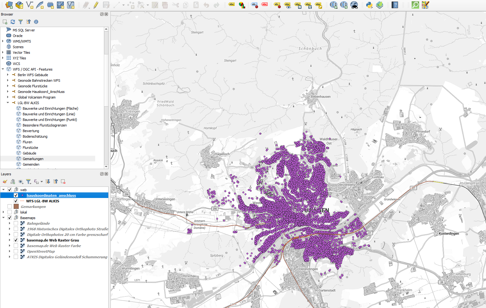

Die Vorbeitung
========

Für unsere Geodatenfrastruktur in GeoNode nutzen wir die Geodaten der vorigen Aufgaben, aber fügen noch weitere hinzu. 
Beziehe dir aus den ALKIS Daten die Gebäude. Aus diesen entfernen wir Gartenhäuser, Garagen, Treibhäuser, Parkhäuser, Wasserbehälter & Umformer.
Jetzt berechne den Mittelpunkt der übrig gebliebenen Gebäude. 

Oder lade dir die Daten via ILAS herunter. Es ist eine Simulation von Hauskorrdinaten, bei denen ein Glasfaserausbau noch aussteht. 
Als weiterer Datensatz nehmen wir die Bahngleise der Gemeinde Tübingen hinzu.

QGIS
------------

   Quelle: `GeoSolutions <https://www.geosolutionsgroup.com/technologies/geonode/>`__

GeoNode
========

Account und Nutzer/innen
------------

Wir müssen uns einmal in der Plattform registrieren. Die Plattform läuft auf internen Server. Zugänge und Links erhälst du im Modul.

Um alle Funktionen von GeoNode voll auszuschöpfen, benötigst du ein Benutzerkonto. Folge diesen Schritten, um ein neues Konto zu erstellen:

1. Auf jeder Seite der Weboberfläche siehst du einen Link zur Registrierung. Klicke auf diesen Link, und das Registrierungsformular wird angezeigt.

.. hint::

      Die Registrierungen in GeoNode müssen offen sein. Falls du den Registrierungslink nicht siehst, ist es nicht möglich, sich zu registrieren, es sei denn, 
      der Administrator der Seite übernimmt dies für dich.

.. figure:: https://docs.geonode.org/en/master/_images/register_button.png
   :alt: GeoNode Registrierung

   Quelle: `GeoNode Registrierung <https://docs.geonode.org/en/master/usage/accounts_user_profile/new_account/index.html>`__

2. Auf der nächsten Seite fülle das Formular aus. Gib einen Benutzernamen und ein Passwort in die Felder ein. Gib auch deine E-Mail-Adresse zur Verifizierung ein.

.. figure:: https://docs.geonode.org/en/master/_images/register_form.png
   :alt: GeoNode Registrierung

   Quelle: `Registrierung für einen neuen Nutzer/in <https://docs.geonode.org/en/master/usage/accounts_user_profile/new_account/index.html>`__

3. Du wirst automatisch eingeloggt und zur Profilseite weitergeleitet. Eine E-Mail wird gesendet, die bestätigt, dass du dich angemeldet hast. Wenn während der Registrierung 
keine Fehler auftreten, werden die folgenden Benachrichtigungen auf dem Bildschirm angezeigt:

.. figure:: https://docs.geonode.org/en/master/_images/register_alerts.png
   :alt: GeoNode Bestätigung

   Quelle: `GeoNode - Registrierungsbestätigung <https://docs.geonode.org/en/master/usage/accounts_user_profile/new_account/index.html>`__

4. Um dich abzumelden, klicke auf den Abmelden-Link im Benutzermenü

.. figure:: https://docs.geonode.org/en/master/_images/register_alerts.png
   :alt: GeoNode Abmeldung

   Quelle: `GeoNode - Abmeldung <https://docs.geonode.org/en/master/usage/accounts_user_profile/new_account/index.html>`__

5. Sobald du ein Konto hast, kannst du dein Profil mit Informationen anreichern. Du kannst auch bestehende Informationen bearbeiten oder löschen. 
Du kannst das Konto mit sozialen Netzwerk verbinden, E-Mail-Adressen verknüpfen und Benachrichtigungseinstellungen verwalten.
Du kannst diese Informationen im Nutzermenü von deiner Profilseite aus aktualisieren. Klicke auf dein Profilbild oben rechts auf dem Bildschirm. Es wird eine Dropdown-Liste angezeigt. Klicke auf Profil, um die Profileinstellungen aufzurufen.

.. figure:: https://docs.geonode.org/en/master/_images/profile_link.png
   :alt: Link zum Profil

   Quelle: `Link zum Profil <https://docs.geonode.org/en/master/usage/accounts_user_profile/new_account/index.html>`__

6. So (oder so ähnlich) wird deine Profilseite aussehen.

.. figure:: https://docs.geonode.org/en/master/_images/user_profile_page.jpg
   :alt: Profil Seite

   Quelle: `GeoNode - Profil Seite <https://docs.geonode.org/en/master/usage/accounts_user_profile/new_account/index.html>`__

7. Deine persönlichen Informationen werden unter dem Benutzernamen angezeigt. Am unteren Rand der Seite sind Ressourcen aufgelistet, die deinem Profil zugeordnet sind. 
Du kannst entscheiden, nur Datensätze, Karten, Dokumente, Dashboards oder Geostories anzeigen zu lassen. Über den Link User datasets WMS GetCapabilities kannst du ein 
XML-Dokument mit der Liste der verfügbaren Datensätze abrufen. Auf der rechten Seite der Seite gibt es viele Links, um persönliche Informationen zu bearbeiten, 
deine Profileinstellungen zu aktualisieren und mit anderen GeoNode-Benutzern in Kontakt zu treten. Der Link *Meine Aktivitäten* ermöglicht es, deine kürzlichen Aktivitäten auf 
GeoNode zu sehen.

.. figure:: https://docs.geonode.org/en/master/_images/user_activities.jpg
   :alt: Aktivtät des Nutzers

   Quelle: `GeoNode - Profil Aktivitäten <https://docs.geonode.org/en/master/usage/accounts_user_profile/new_account/index.html>`__

QGIS Plugin
------------

Es gibt seit Januar 2025 eine neue Version des GeoNode-Plugins für QGIS! Das Plugin ermöglicht es Ressourcen aus einem GeoNode-Katalog in QGIS zu suchen, zu filtern und zu laden. 
Es unterstützt authentifizierten Zugriff auf die Ressourcen über WMS, WFS und WCS und nutzt die GeoNode REST API. 
Authentifizierte Benutzer können den Stil und die Daten (nur für Vektordaten) der Ressourcen bearbeiten und neue Datensätze zu GeoNode hochladen. 
Grundlegende Metadateninformationen können ebenfalls direkt aus QGIS bearbeitet werden.

**Verbindung herstellen**

Passwörter und Nutzernamen erhälst du im Modul. Jetzt wollen wir eine Verbindun herstellen.

.. figure:: https://geosolutionsgroup.com/wp-content/uploads/2025/01/qgisgeonode.jpg?x67834
   :alt: QGIS-plugin für Geonode

   Quelle: `QGIS-plugin für Geonode <https://www.geosolutionsgroup.com/blog/geonode-4-4/>`__
