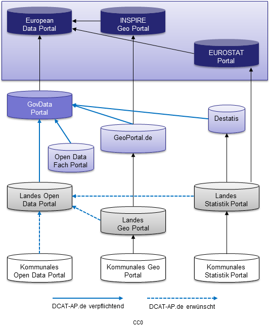

Beispiel Metadatenerfassung am Beispiel NRW:  
========

Der Leitfaden zur Metadatenerfassung im Open.NRW-Portal Version 2.2 beschreibt, wie Metadaten für offene Verwaltungsdaten in Nordrhein-Westfalen – 
insbesondere für das Open.NRW-Portal und den GEOkatalog.NRW – erfasst werden. Maßgeblich ist der nationale Metadatenstandard DCAT-AP.de. 
Für Geodaten mit INSPIRE-Relevanz gelten besondere Anforderungen.

.. hint::

   Zum Leitfaden: https://open.nrw/system/files/media/document/file/leitfaden_zur_metadatenerfassung.pdf

   Quelle: `Standardisierungsbedarf der Metadatenföderation GovData, Quelle: DCAT-AP <https://www.dcat-ap.de/def/dcatde/3.0/spec/#standardisierungsbedarf>`__

Wesentliche Metadatenfelder laut Leitfaden (9 Kernelemente)
-----------------------------------------------------------

- **Titel:** Aussagekräftig, max. 130 Zeichen, keine Abkürzungen.
- **Kategorien:** Mindestens eine (z. B. Umwelt, Verkehr, Wirtschaft), Mehrfachzuordnung möglich.
- **Schlagwörter:** Mehrere, max. 100 Zeichen pro Schlagwort, durch Kommas getrennt.
- **Beschreibung:** Ausführliche Beschreibung des Datensatzes (max. 3.000 Zeichen), inkl. Entstehung und Format.
- **Vorschaubild (optional):** 200x150 Pixel, GIF/PNG/JPG, max. 1 MB.
- **Aktualität/Veröffentlichungsdatum:** Veröffentlichungs- und ggf. Aktualisierungsdatum.
- **Aktualisierungsfrequenz (optional):** Auswahl aus vorgegebenen Optionen (z. B. „unregelmäßig“).
- **Abdeckung (optional):** Räumlicher Bezug, Auswahl administrativer Einheiten möglich.
- **Kontaktinformationen:** Name der Organisation, E-Mail (Funktionspostfach empfohlen), Telefonnummer (nach DIN 5008), URL der Organisation.
- **Herausgeber:** Wird aus dem Profil übernommen, muss ggf. doppelt angegeben werden.
- **Distributionen:** Beschreibung, Zugangs-/Download-URL, Lizenz (explizite Auswahl erforderlich), Format, Aktualisierungsdatum, Dokumentation/Links.
- **Publikationsstatus:** Öffentlich/nicht öffentlich.

Besonderheiten für Geodaten und INSPIRE
---------------------------------------

- Geodaten mit INSPIRE-Bezug (d. h. Daten, die unter ein INSPIRE-Thema fallen oder inhärent räumliche Sachverhalte beschreiben), müssen immer über den GEOkatalog.NRW eingestellt werden.
- Eine doppelte Beschreibung in mehreren Portalen ist zu vermeiden – INSPIRE gibt vor, wo die Metadaten primär gepflegt werden müssen.
- Bei der Erfassung in Open.NRW kann eine zusätzliche Veröffentlichung im GEOkatalog.NRW gekennzeichnet werden (empfohlen, wenn Geobezug erkannt wird).
- Ein Geobezug liegt vor, wenn:
  - Die Daten in einem räumlichen Dateiformat (z. B. GeoJSON, Shape, OGC WMS) vorliegen,
  - ein Raumbezug in den Metadaten angegeben ist.
- Metadaten aus dem GEOkatalog.NRW sind auch im Open.NRW-Portal auffindbar und umgekehrt, sofern entsprechend gekennzeichnet.

Was bringt der Leitfaden für INSPIRE-Metadaten?
-----------------------------------------------

- **Sicherstellung der INSPIRE-Konformität:** Er macht klar, dass INSPIRE-relevante Geodaten zwingend im GEOkatalog.NRW geführt werden müssen.
- **Vermeidung von Redundanzen:** Es wird explizit darauf hingewiesen, dass Geodaten nur an einer Stelle beschrieben werden sollen, wie von INSPIRE gefordert.
- **Synergie zwischen Open Data und Geodateninfrastruktur:** Durch die Kooperation zwischen Open.NRW und GEOkatalog.NRW können Metadaten effizient zwischen den Portalen geteilt werden.
- **Unterstützung bei der Metadatenerfassung:** Der Leitfaden gibt eine strukturierte Anleitung, welche Metadatenfelder auszufüllen sind, um sowohl die Anforderungen von Open Data als auch von INSPIRE zu erfüllen.

Fazit
-----

Der Leitfaden hilft, Metadaten strukturiert, vollständig und standardkonform zu erfassen. Für INSPIRE-relevante Geodaten ist der GEOkatalog.NRW die zentrale Plattform, die auch die Anforderungen der europäischen Geodateninfrastruktur erfüllt. Die klare Trennung und Verknüpfung der Portale sorgt für Effizienz und Rechtssicherheit bei der Metadatenerfassung.

Zum Leitfaden:  
https://open.nrw/system/files/media/document/file/leitfaden_zur_metadatenerfassung.pdf  
https://view.officeapps.live.com/op/view.aspx?src=https%3A%2F%2Fwww.gdi.nrw%2Fsystem%2Ffiles%2Fmedia%2Fdocument%2Ffile%2F2024-01-10_metadatenprofil_nrw_2_2_0_iso.xlsx&wdOrigin=BROWSELINK

Quellen
-------

.. [5] https://de.wikipedia.org/wiki/ISO_19115
.. [6] https://gispoint.de/fileadmin/user_upload/paper_gis_open/537508080.pdf
.. [7] https://www.geosn.sachsen.de/redmine/projects/metadaten/wiki/Metadatenelemente_nach_INSPIRE-Festlegungen_Dienst
.. [8] https://enterprise.arcgis.com/de/inspire/10.5/get-started/standards-support.htm
.. [9] https://gdi.bmel.de/metadaten
.. [10] https://de.ryte.com/wiki/Dublin_Core
.. [11] https://www.forschungsdaten.org/index.php/Dublin_Core
.. [12] https://wiki.selfhtml.org/wiki/Websemantics/Dublin_Core
.. [13] https://wiki.dnb.de/download/attachments/272237368/Einf%C3%BChrung_in_Metadaten_und_Metadatenformate_final.pdf?api=v2
