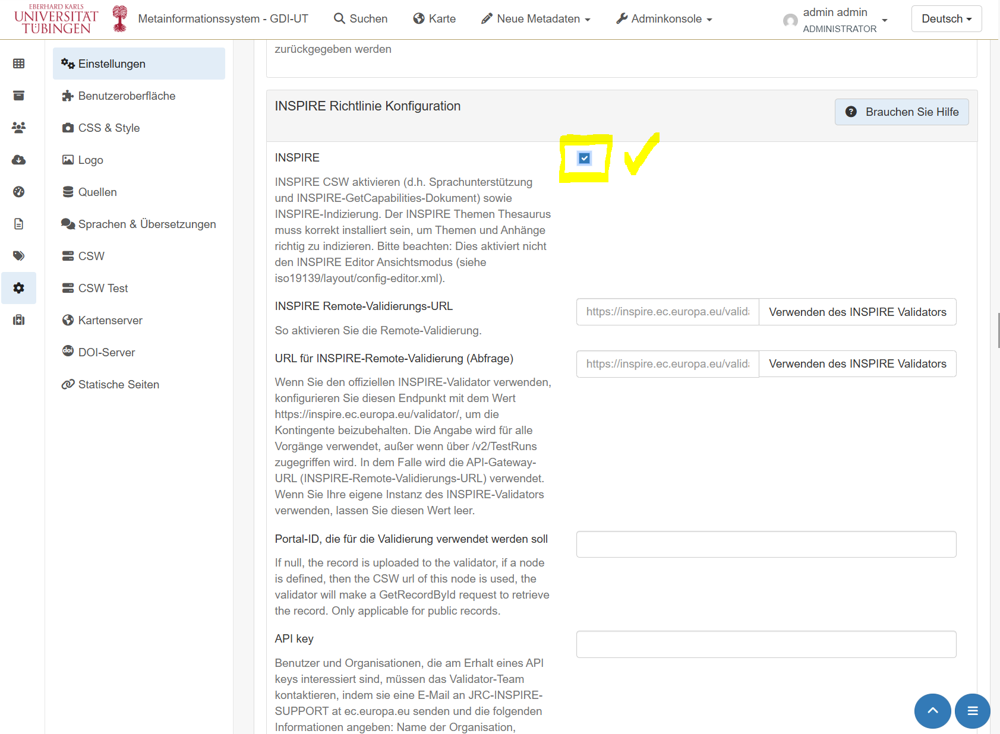
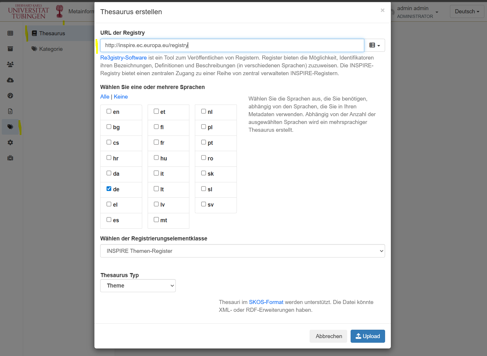
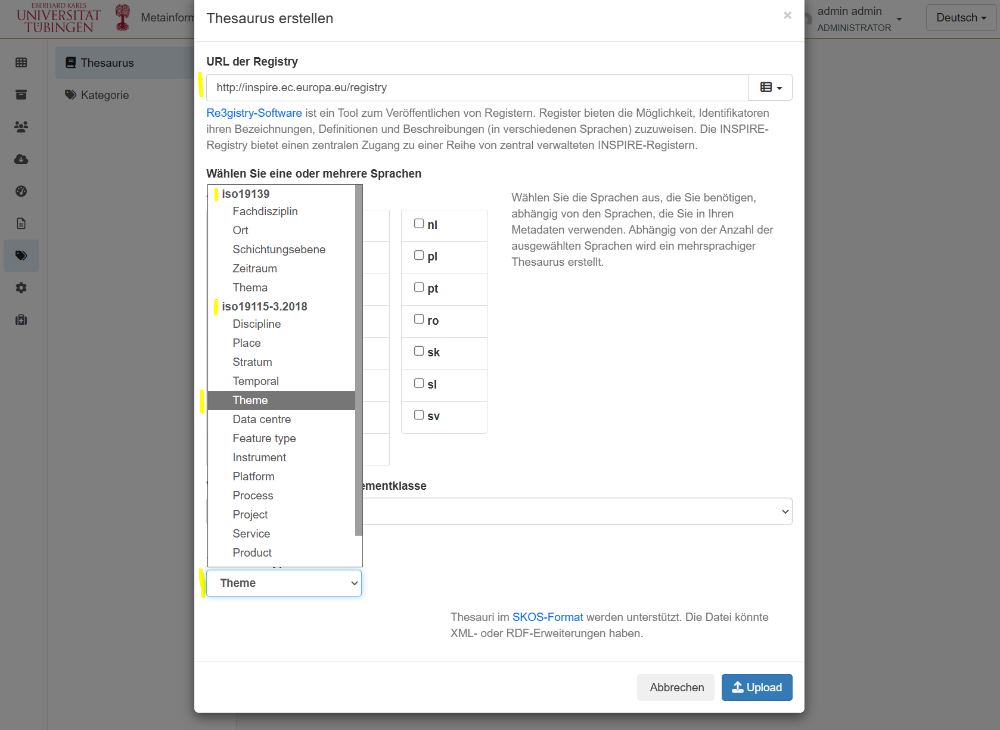
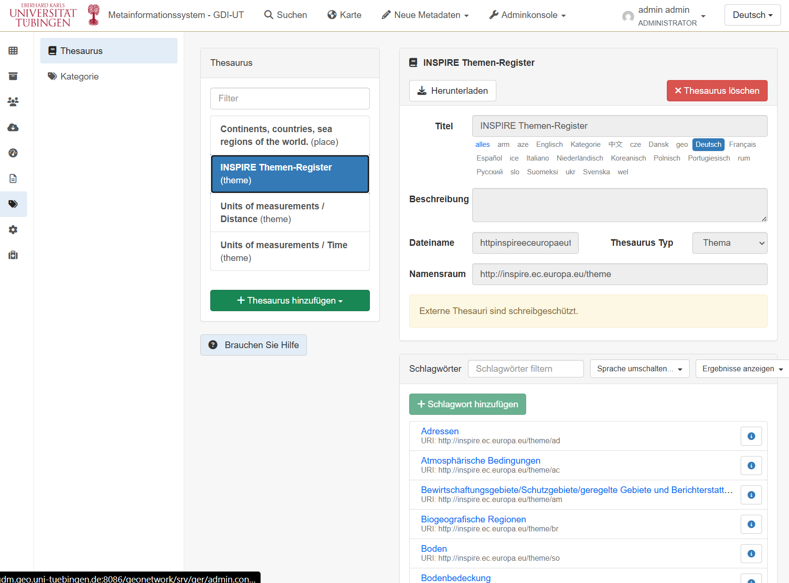

GeoNetwork für INSPIRE konfigurieren
========

.. hint::

      Um den FARI Prinzipien u.a. des OGC gerecht zu werden, ISO-konforme Geodaten bereitzustellen
      und ggf. auch INSPIRE-Anforderungen zu erfüllen gibt es eine Reihe von Software, die uns dabei unterstützt diese Anforderungen zu erfüllen.

.. hint::

      Es gibt verschiedene Normen, die mit Hilfe von GeoNetwork und dessen Benutzeroberfläche verwaltet werden können:

      - Dublin Core
      - ISO 19115 (oder Vorgänger ISO 19139)
      - INSPIRE

      Diese Normen finden sich in der *Adminkonsole* unter *Metadaten & Vorlagen*

INSPIRE in GeoNetwork konfigurieren
-----------

GeoNetwork ermöglicht er uns einen INSPIRE Validator der EU einzubetten und somit unsere Metadateneinträge in GeoNetwork direkt auf INSPIRE-Konformität zu prüfen. 
Darüber hinaus erlaubt un GeoNetwork die INSPIRE-konformen Kategorien einzurichten.

Der INSPIRE Validator der EU
-----------

In den Einstellungen von GeoNetwork, kann INSPIRE aktiviert (Häkchen gesetzt werden) und ein Validator der EU eingebunden werden. `ACHTUNG: Aktuell ist der Validator der EU nicht erreichbar, weshalb die Validierung in GeoNetwork nicht funktioniert. Sobald der Validator wieder erreichbar ist, könnt ihr eure Metadateneinträge direkt in GeoNetwork auf INSPIRE-Konformität prüfen. <https://knowledge-base.inspire.ec.europa.eu/news-and-publications/news/discontinuation-inspire-reference-validator-2026-04-01_en>`__

Grund: "Following a comprehensive transition of the INSPIRE infrastructure planned for 2026"

- `Configuring for the INSPIRE Directive (engl.) <https://docs.geonetwork-opensource.org/4.4/administrator-guide/configuring-the-catalog/inspire-configuration/>`__

- `INSPIRE Validator der EU <https://inspire-validator.eu/>`__

   `GeoNetwork INSPIRE Validierung aktivieren <https://docs.geonetwork-opensource.org/3.12/administrator-guide/configuring-the-catalog/inspire-configuration/#enabling-inspire>`__

INSPIRE Validator nutzen
-----------

Wenn er funktioniert, dann lässt sich der Validator bei den einzelnen Metadateneinträgen nutzen. Dort findet sich ein Tab "Validierung", der die Validierungsergebnisse anzeigt.

.. figure:: https://docs.geonetwork-opensource.org/3.12/administrator-guide/configuring-the-catalog/img/inspire-validation-menu.png
   :alt: GeoNetwork INSPIRE aktivieren
   :width: 450px

   `GeoNetwork INSPIRE Validierung aktivieren <https://docs.geonetwork-opensource.org/3.12/administrator-guide/configuring-the-catalog/inspire-configuration/#inspire-validation>`__

INSPIRE-konforme Kategorien einrichten
-----------

INSPIRE codelists hinzufügen: Codelisten wie z. B. die offiziellen INSPIRE-Themen oder der GEMET-Thesaurus standardisieren und erleichtern die Zuordnung zu Schlagwörtern.

1. Wechsle in die **Administrationskonsole** (Admin Console).
2. Gehe zu **Klassifikationssysteme** (Classification systems) > **Thesauri**.
3. Klicke auf **Thesaurus hinzufügen** (Add thesaurus).
4. Wähle **Von vordefinierter Liste hinzufügen** (Add from default/register).
5. Suche nach den INSPIRE-Themen (oft unter ``inspire-theme``) und dem allgemeinen GEMET-Thesaurus.
6. Wähle sie aus und klicke auf **Importieren**.

   `GeoNetwork INSPIRE Schlagwörter einbinden <https://docs.geonetwork-opensource.org/3.12/administrator-guide/configuring-the-catalog/inspire-configuration/#loading-inspire-codelists>`__

   `GeoNetwork INSPIRE Schlagwörter einbinden und Kategorien einsehen <https://docs.geonetwork-opensource.org/3.12/administrator-guide/configuring-the-catalog/inspire-configuration/#loading-inspire-codelists>`__

   `GeoNetwork INSPIRE Schlagwörter wurden hinzugefügt <https://docs.geonetwork-opensource.org/3.12/administrator-guide/configuring-the-catalog/inspire-configuration/#loading-inspire-codelists>`__

